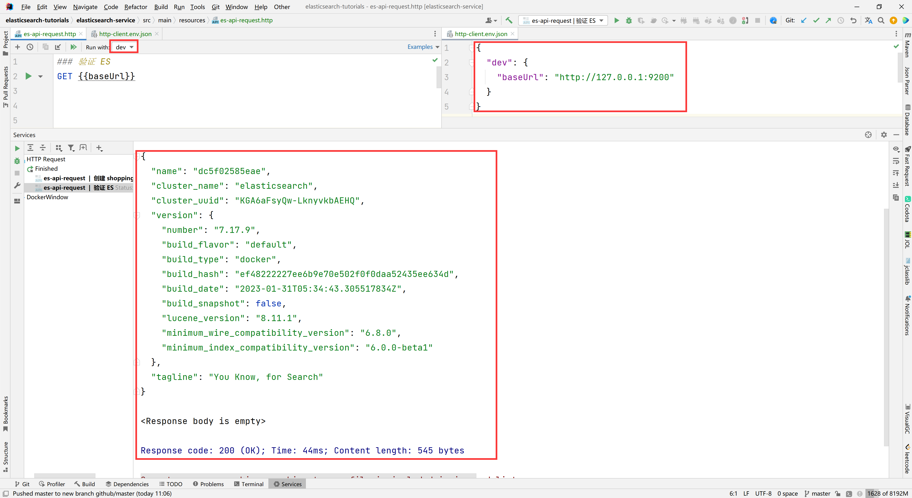
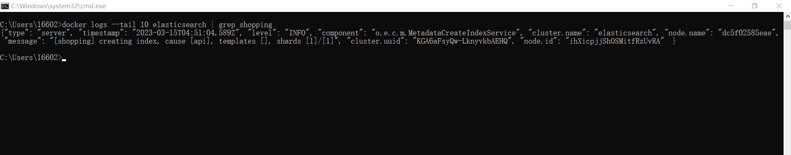
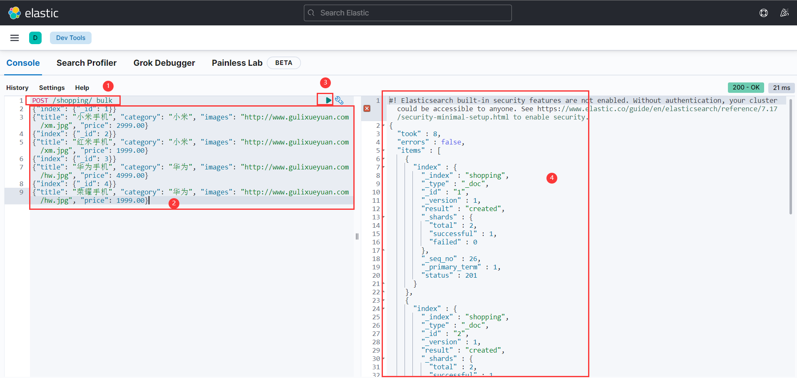
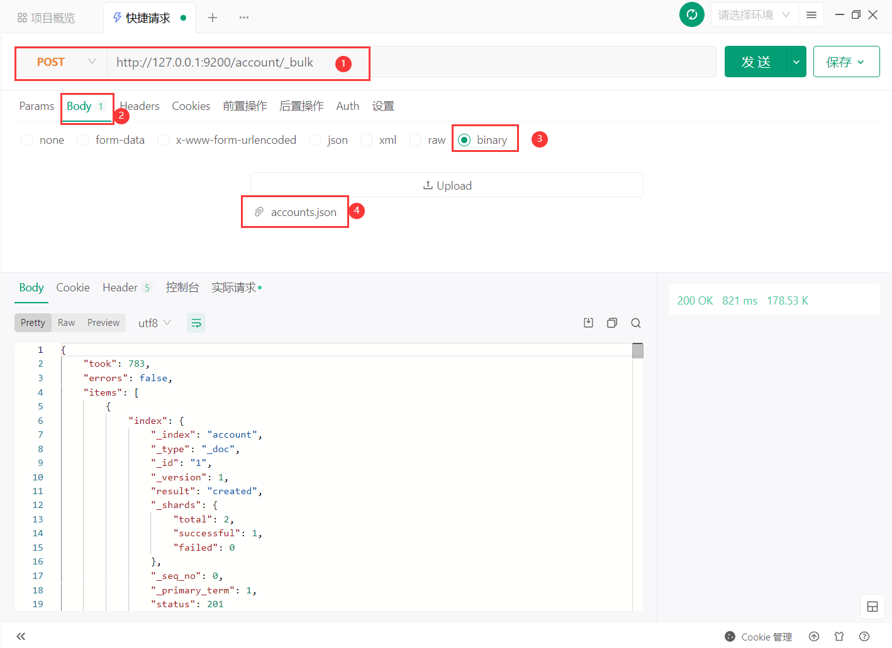

# ElasticSearch 概述

## ElasticSearch 是什么？

在提到 ElasticSearch 之前，我们先来了解一下 Elastic Stack。Elastic Stack 核心产品包括 Elasticsearch、Kibana、Beats 和 Logstash（也称为 ELK
Stack）等等。能够安全可靠地获取任何来源、任何格式的数据，然后实时地对数据进行搜索、分析和可视化。

ElasticSearch，简称为 ES， ES 是一个**基于 JSON 的分布式、RESTFul 风格的搜索和数据分析引擎**，能够解决不断涌现出的各种用例。作为 Elastic Stack 的核心，Elasticsearch
会集中存储数据，可以飞快完成搜索，微调相关性，进行强大的分析，并轻松缩放规模。

它可以近乎实时的存储、检索数据；本身扩展性很好，可以扩展到上百台服务器，处理 PB 级别的数据。

> elastic</br>
> 英 [ɪˈlæstɪk] 美 [ɪˈlæstɪk] </br>
> n. 橡皮圈(或带);松紧带 </br>
> adj. 橡皮圈(或带)的;有弹性的;有弹力的;灵活的;可改变的;可伸缩的

## 全文搜索引擎

Google，百度类的网站搜索，它们都是根据网页中的关键字生成索引，我们在搜索的时候输入关键字，它们会将该关键字即索引匹配到的所有网页返回；还有常见的项目中应用日志的搜索等等。对于这些非结构化的数据文本，关系型数据库搜索不是能很好的支持。

一般传统数据库，全文检索都实现的很鸡肋，因为一般也没人用数据库存文本字段。进行全文检索需要扫描整个表，如果数据量大的话即使对 SQL 的语法优化，也收效甚微。建立了索引，但是维护起来也很麻烦，对于 insert 和 update
操作都会重新构建索引。

基于以上原因可以分析得出，在一些生产环境中，使用常规的搜索方式，性能是非常差的：

- 搜索的数据对象是大量的非结构化的文本数据。
- 文件记录量达到数十万或数百万个甚至更多。
- 支持大量基于交互式文本的查询。
- 需求非常灵活的全文搜索查询。
- 对高度相关的搜索结果的有特殊需求，但是没有可用的关系数据库可以满足。
- 对不同记录类型、非文本数据操作或安全事务处理的需求相对较少的情况。为了解决结构化数据搜索和非结构化数据搜索性能问题，我们就需要专业，健壮，强大的全文搜索引擎。

**这里说到的全文搜索引擎指的是目前广泛应用的主流搜索引擎**
。它的工作原理是计算机索引程序通过扫描文章中的每一个词，对每一个词建立一个索引，指明该词在文章中出现的次数和位置，当用户查询时，检索程序就根据事先建立的索引进行查找，并将查找的结果反馈给用户的检索方式。这个过程类似于通过字典中的检索字表查字的过程。

## ElasticSearch 应用案例

- GitHub: 2013 年初，抛弃了 Solr，采取 Elasticsearch 来做 PB 级的搜索。 “GitHub 使用Elasticsearch 搜索 20TB 的数据，包括 13 亿文件和 1300 亿行代码”。
- 维基百科：启动以 Elasticsearch 为基础的核心搜索架构
- 百度：目前广泛使用 Elasticsearch 作为文本数据分析，采集百度所有服务器上的各类指标数据及用户自定义数据，通过对各种数据进行多维分析展示，辅助定位分析实例异常或业务层面异常。目前覆盖百度内部 20
  多个业务线（包括云分析、网盟、预测、文库、直达号、钱包、 风控等），单集群最大 100 台机器， 200 个 ES 节点，每天导入 30TB+数据。
- 新浪：使用 Elasticsearch 分析处理 32 亿条实时日志。
- 阿里：使用 Elasticsearch 构建日志采集和分析体系。
- Stack Overflow：解决 Bug 问题的网站，全英文，编程人员交流的网站。

# ElasticSearch 环境

## 基础环境搭建

关于 ElasticSearch 环境的搭建，请参考文档：[elasticsearch环境搭建指南](elasticsearch环境搭建指南.md)

## ES-api 请求测试

为了省事，这里以 idea 开发工具中自带的 `HTTP Request` 插件为例进行请求测试（下同），当然你可以选择 [postman](https://www.postman.com/)
或者 [Apifox](https://www.apifox.cn/) 或者其他工具来测试。

- 新建 `http-client.env.json` 文件；

```json
{
  "dev": {
    "baseUrl": "http://127.0.0.1:9200"
  }
}
```

- 新建 `es-api-request.http` 文件

```http request
### 验证 ES 是否成功
GET {{baseUrl}}
```

效果如下图所示：



# ElasticSearch 入门

## 索引

正排索引（传统）

| id   | content              |
|------|----------------------|
| 1001 | my name is zhang san |
| 1002 | my name is li si     |

倒排索引

| keyword | id         |
|---------|------------|
| name    | 1001, 1002 |
| zhang   | 1001       |

ElasticSearch 是**面向文档型数据库**，一条数据在这里就是一个文档。为了方便大家理解，我们将 Elasticsearch 里存储文档数据和关系型数据库 MySQL 存储数据的概念进行一个类比。


ES 里的 `Index` 可以看做一个库，而 `Type` 相当于表， `Documents` 则相当于表的行。这里 `type` 的概念已经被逐渐弱化，ElasticSearch 6.X 中，一个 `index`
下已经只能包含一个 `type`， Elasticsearch 7.X 中, `type` 的概念已经被删除了。

### 创建索引

对比关系型数据库，创建索引就等同于创建数据库。

向 ES 服务器发 PUT 请求：`http://127.0.0.1:9200/shopping`。

```http request
### 创建 shopping 索引
PUT {{baseUrl}}/shopping
```

响应结果：

```text
{
  "acknowledged": true,            // 响应结果
  "shards_acknowledged": true,     // 分片结果
  "index": "shopping"              // 索引名称
}
```

执行日志

```shell
docker logs --tail 10 elasticsearch | grep shopping
```

```text
{"type": "server", "timestamp": "2023-03-15T04:51:04,589Z", "level": "INFO", "component": "o.e.c.m.MetadataCreateIndexService", "cluster.name": "elasticsearch", "node.na
me": "dc5f02585eae", "message": "[shopping] creating index, cause [api], templates [], shards [1]/[1]", "cluster.uuid": "KGA6aFsyQw-LknyvkbAEHQ", "node.id": "ihXicpjjShO
SMitfRzUvRA"  }
```

效果如下图所示：



**注意**：

win 10 下执行 `grep` 命令，会提示如下错误：

```text
grep : 无法将“grep”项识别为 cmdlet、函数、脚本文件或可运行程序的名称。请检查名称的拼写，如果包括路径，请确保路径正确，然后再试一次。
```

出现上述错误，可以尝试安装 `grep` ，安装参考链接：https://www.cnblogs.com/shenxiaolin/p/16662793.html

### 查询索引

#### 查询所有索引

向 ES 服务器发 GET 请求：`http://127.0.0.1:9200/_cat/indices?v`

```http request
### 查询所有索引
GET {{baseUrl}}/_cat/indices?v
```

这里请求路径中的 `_cat` 表示查看的意思， `indices` 表示索引，所以整体含义就是查看当前 ES 服务器中的所有索引，就好像 MySQL 中的 `show tables` 的感觉，服务器响应结果如下：

```text
health status index                           uuid                   pri rep docs.count docs.deleted store.size pri.store.size
green  open   .geoip_databases                m_2rhbeoQQW9xGX2rmdCfA   1   0         42            0     40.7mb         40.7mb
green  open   .apm-custom-link                n-W9098GR0-wGpEt5tvuhA   1   0          0            0       226b           226b
green  open   .kibana_7.17.9_001              g-Qu0wiyRNeHqK_y-W9-sw   1   0        624            1      2.4mb          2.4mb
green  open   .apm-agent-configuration        8ewjD7bCSZCKu5m7SycxkQ   1   0          0            0       226b           226b
green  open   .kibana_task_manager_7.17.9_001 EugcrviHQaKXRPEBd40Qog   1   0         17        24140      2.8mb          2.8mb
yellow open   shopping                        M25FBpYdQN6swLZmkpMBnw   1   1          0            0       226b           226b
green  open   .tasks                          fxZ7WSS9Q_qznYoHcR22VQ   1   0          2            0     13.9kb         13.9kb
```

|      **表头**      |                         **含义**                         |
|:----------------:|:------------------------------------------------------:|
|      health      |  当前服务器健康状态： green(集群完整) yellow(单点正常、集群不完整) red(单点不正常)  |
|      status      |                       索引打开、关闭状态                        |
|      index       |                          索引名                           |
|       uuid       |                         索引统一编号                         |
|       pri        |                         主分片数量                          |
|       rep        |                          副本数量                          |
|    docs.count    |                         可用文档数量                         |
|   docs.deleted   |                      文档删除状态（逻辑删除）                      |
|    store.size    |                     主分片和副分片整体占空间大小                     |
|  pri.store.size  |                        主分片占空间大小                        |

#### 查询单个索引

向 ES 服务器发 GET 请求：`http://127.0.0.1:9200/shopping`

```http request
### 查看单个索引
GET {{baseUrl}}/shopping
```

服务器响应结果如下：

```text
{
  "shopping": { // 索引名
    "aliases": {}, // 别名
    "mappings": {}, // 映射
    "settings": { // 设置
      "index": {  // 设置 - 索引
        "routing": {  // 设置 - 索引 - 路由
          "allocation": {  // 设置 - 索引 - 路由 - 分片
            "include": {  // 分片包含的数据层（节点）首选项
              "_tier_preference": "data_content"
            }
          }
        },
        "number_of_shards": "1", // 设置 - 索引 - 主分片数量
        "provided_name": "shopping",
        "creation_date": "1678855864543", // 设置 - 索引 - 创建时间
        "number_of_replicas": "1", // 设置 - 索引 - 副本数量
        "uuid": "M25FBpYdQN6swLZmkpMBnw", // 设置 - 索引 - 索引统一编号
        "version": {  // 设置 - 索引 - 版本 - 创建
          "created": "7170999"
        }
      }
    }
  }
}
```

### 删除单个索引

向 ES 服务器发 DELETE 请求：`http://127.0.0.1:9200/shopping`

```http request
### 删除单个索引
DELETE {{baseUrl}}/shopping
```

服务器响应结果如下：

```text
{
  "acknowledged": true
}
```

再次查看所有索引，`GET http://127.0.0.1:9200/_cat/indices?v` ，返回结果如下：

```text
health status index                           uuid                   pri rep docs.count docs.deleted store.size pri.store.size
green  open   .geoip_databases                m_2rhbeoQQW9xGX2rmdCfA   1   0         42            0     40.7mb         40.7mb
green  open   .apm-custom-link                n-W9098GR0-wGpEt5tvuhA   1   0          0            0       226b           226b
green  open   .kibana_7.17.9_001              g-Qu0wiyRNeHqK_y-W9-sw   1   0        627           12      2.4mb          2.4mb
green  open   .apm-agent-configuration        8ewjD7bCSZCKu5m7SycxkQ   1   0          0            0       226b           226b
green  open   .kibana_task_manager_7.17.9_001 EugcrviHQaKXRPEBd40Qog   1   0         17        38303      4.1mb          4.1mb
green  open   .tasks                          fxZ7WSS9Q_qznYoHcR22VQ   1   0          2            0     13.9kb         13.9kb
```

根据结果看出 `shopping` 索引已经不存在，说明成功！

## 文档

### 创建文档

这里的文档可以类比为关系型数据库中的表数据，添加的数据格式为 **JSON** 格式。

向 ES 服务器发 POST 请求：`http://127.0.0.1:9200/shopping/_doc` ，请求体 JSON 内容为：

```json
{
  "title": "小米手机",
  "category": "小米",
  "images": "http://www.gulixueyuan.com/xm.jpg",
  "price": 3999.00
}
```

```http request
### 创建文档（此方式不能使用 PUT；自动生成唯一标识，可以指定，比如：xxx/shopping/_doc/1，此方式可以使用 PUT）
POST {{baseUrl}}/shopping/_doc
Content-Type: application/json

{
  "title":"小米手机",
  "category":"小米",
  "images":"http://www.gulixueyuan.com/xm.jpg",
  "price":3999.00
}
```

注意，此处发送请求的方式必须为 POST，不能是 PUT，否则会发生错误，提示的错误如下所示：

```text
{
  "error": "Incorrect HTTP method for uri [/shopping/_doc] and method [PUT], allowed: [POST]",
  "status": 405
}
```

自定义唯一标识这种请求可以使用 PUT，如下所示：

```http request
### 新增文档（当指定唯一标识时可以使用 PUT）
PUT {{baseUrl}}/shopping/_doc/2
Content-Type: application/json

{
  "title":"华为手机",
  "category":"华为",
  "images":"http://www.gulixueyuan.com/hw.jpg",
  "price":4999.00
}
```

服务器响应结果如下：

```text
{
  "_index": "shopping", // 索引
  "_type": "_doc",      // 类型 - 文档
  "_id": "t1eX6IYB1yjqbUaozmwa", // 唯一标识，可以类比为 MySQL 中的主键，随机生成
  "_version": 1,    // 版本
  "result": "created", // 结果，这里的 created 表示创建成功
  "_shards": {      // 分片
    "total": 2,     // 分片 - 总数
    "successful": 1, // 分片 - 成功数
    "failed": 0 // 分片 - 失败数
  },
  "_seq_no": 0, 
  "_primary_term": 1
}
```

上面的数据创建后，由于没有指定数据唯一性标识（ID），默认情况下， ES 服务器会随机生成一个。

如果想要自定义唯一性标识，需要在创建时指定：`http://127.0.0.1:9200/shopping/_doc/1` 。

**注意**：

**如果增加数据时明确数据主键，那么请求方式除了使用 POST 以外，也可以为 PUT**。

### 查询文档

#### 全查询

查看索引下所有数据，向 ES 服务器发 GET 请求：`http://127.0.0.1:9200/shopping/_search`

```http request
### 查询文档（全查询）
GET {{baseUrl}}/shopping/_search
```

服务器响应结果如下：

```text
{
  "took": 9,
  "timed_out": false,
  "_shards": {
    "total": 1,
    "successful": 1,
    "skipped": 0,
    "failed": 0
  },
  "hits": {
    "total": {
      "value": 2,
      "relation": "eq"
    },
    "max_score": 1.0,
    "hits": [
      {
        "_index": "shopping",
        "_type": "_doc",
        "_id": "t1eX6IYB1yjqbUaozmwa",
        "_score": 1.0,
        "_source": {
          "title": "小米手机",
          "category": "小米",
          "images": "http://www.gulixueyuan.com/xm.jpg",
          "price": 3999.00
        }
      },
      {
        "_index": "shopping",
        "_type": "_doc",
        "_id": "1",
        "_score": 1.0,
        "_source": {
          "title": "华为手机",
          "category": "华为",
          "images": "http://www.gulixueyuan.com/hw.jpg",
          "price": 4999.00
        }
      }
    ]
  }
}
```

#### 主键查询

查询文档时，需要指明文档的唯一性标识，类似于 MySQL 中数据的主键查询。

向 ES 服务器发 GET 请求：`http://127.0.0.1:9200/shopping/_doc/1`

```http request
### 查询文档（主键查询）
GET {{baseUrl}}/shopping/_doc/1
```

服务器响应结果如下：

```text
{
  "_index": "shopping",
  "_type": "_doc",
  "_id": "1",
  "_version": 5,
  "_seq_no": 9,
  "_primary_term": 1,
  "found": true,
  "_source": {
    "title": "华为手机",
    "category": "华为",
    "images": "http://www.gulixueyuan.com/hw.jpg",
    "price": 4999.00
  }
}
```

查找不存在的内容，向 ES 服务器发 GET 请求：`http://127.0.0.1:9200/shopping/_doc/1001`

服务器响应结果如下：

```text
{
  "_index": "shopping",
  "_type": "_doc",
  "_id": "1001",
  "found": false    // 为 false 表示未查询到
}
```

### 修改文档

#### 全量修改

和创建文档一样，输入相同的 URL 地址请求，如果请求体变化，会将原有的数据内容覆盖。

向 ES 服务器发 POST 请求：`http://127.0.0.1:9200/shopping/_doc/1` ，请求体 JSON 内容为：

```json
{
  "title": "华为手机",
  "category": "华为",
  "images": "http://www.gulixueyuan.com/hw.jpg",
  "price": 4999.00
}
```

```http request
### 修改文档（全量修改）
PUT {{baseUrl}}/shopping/_doc/1
Content-Type: application/json

{
  "title": "华为手机",
  "category": "华为",
  "images": "http://www.gulixueyuan.com/hw.jpg",
  "price": 4999.00
}
```

服务器响应结果如下：

```text
{
  "_index": "shopping",
  "_type": "_doc",
  "_id": "1",
  "_version": 2,       // 版本号，每次改变都 + 1
  "result": "updated", // 结果，这里的 updated 表示修改成功
  "_shards": {
    "total": 2,
    "successful": 1,
    "failed": 0
  },
  "_seq_no": 5,
  "_primary_term": 1
}
```

#### 局部修改

修改数据时，也可以只修改某一给条数据的局部信息。

向 ES 服务器发 POST 请求：`http://127.0.0.1:9200/shopping/_update/1` ，请求体 JSON 内容为：

```http request
### 修改文档（局部修改）
POST {{baseUrl}}/shopping/_update/1
Content-Type: application/json

{
  "doc": {
    "title": "荣耀手机",
    "category": "华为",
    "price": 1999.00
  }
}
```

**注意**：

**全量修改既可以使用 POST 方式，也可以使用 PUT 方式；局部修改只能使用 POST 方式，不能使用 PUT 方式**。

服务器响应结果如下：

```text
{
  "_index": "shopping",
  "_type": "_doc",
  "_id": "1",
  "_version": 3,
  "result": "updated",
  "_shards": {
    "total": 2,
    "successful": 1,
    "failed": 0
  },
  "_seq_no": 10,
  "_primary_term": 1
}
```

向 ES 服务器发 GET 请求：`http://127.0.0.1:9200/shopping/_doc/1` ，查看修改内容：

```text
{
  "_index": "shopping",
  "_type": "_doc",
  "_id": "1",
  "_version": 16,
  "_seq_no": 20,
  "_primary_term": 1,
  "found": true,
  "_source": {
    "title": "荣耀手机",
    "category": "华为",
    "images": "http://www.gulixueyuan.com/hw.jpg",
    "price": 1999.0
  }
}
```

### 删除文档

删除一个文档不会立即从磁盘上移除，它只是被标记成已删除（逻辑删除）。

向 ES 服务器发 DELETE 请求：`http://127.0.0.1:9200/shopping/_doc/1`

```http request
### 删除文档（逻辑删除）
DELETE {{baseUrl}}/shopping/_doc/1
```

服务器响应结果如下：

```text
{
  "_index": "shopping",
  "_type": "_doc",
  "_id": "1",
  "_version": 4,
  "result": "deleted", // 结果，这里的 deleted 表示删除成功，这里是逻辑删除
  "_shards": {
    "total": 2,
    "successful": 1,
    "failed": 0
  },
  "_seq_no": 21,
  "_primary_term": 1
}
```

向 ES 服务器发 GET 请求：`http://127.0.0.1:9200/shopping/_doc/1` ，查看是否删除成功：

```text
{
  "_index": "shopping",
  "_type": "_doc",
  "_id": "1",
  "found": false
}
```

### 批量操作文档

提到批量操作文档，我们需要使用到 `bulk` **批量增删改**的操作
API。官方说明：[docs-bulk](https://www.elastic.co/guide/en/elasticsearch/reference/7.17/docs-bulk.html)

1. 语法

`bulk` 对 JSON 串的有着严格的要求。**每个 JSON 串不能换行，只能放在同一行**。同时，**相邻的 JSON 串之间必须要有换行**（Linux 下是 `\n`；Window 下是 `\r\n`）。bulk
的每个操作必须要一对 JSON 串（delete 语法除外）。

```text
action_and_meta_data\n
optional_source\n
action_and_meta_data\n
optional_source\n
....
action_and_meta_data\n
optional_source\n
```

**注意**：

最后一行数据必须以换行符 `\n` 结束。每个换行符前可以加回车 `\r`。将 `NDJSON` 数据发送到 `_bulk` 端点时，请使用 `application/json` 或 `application/x-ndjson`
的 `Content-Type` 标头。

2. 操作类型

- `create` 如果文档不存在就创建，但如果文档存在就返回错误；
- `index` 如果文档不存在就创建，如果文档存在就更新；
- `update` 更新一个文档，如果文档不存在就返回错误；
- `delete` 删除一个文档，如果要删除的文档id不存在，就返回错误。

其实可以看得出来 index 是比较常用的。还有 bulk 的操作，某一个操作失败，是不会影响其他文档的操作的，它会在返回结果中告诉你失败的详细的原因。

3. 操作工具

关于批量操作，我这里选择使用 kibana 的 `dev_tools`
终端控制台来操作（下同），在线测试地址：[http://localhost:5601/app/dev_tools#/console](http://localhost:5601/app/dev_tools#/console)

由于 idea 中的 HTTP Request 插件没有找到方法进行测试批量操作，这里主要采用 kibana 的 `dev_tools`，或者使用 Apifox 工具进行测试。

如下图所示：





4. 官方测试集

测试集地址：[https://download.elastic.co/demos/kibana/gettingstarted/accounts.zip](https://download.elastic.co/demos/kibana/gettingstarted/accounts.zip)

### 批量插入

```text
POST /shopping/_bulk
{"index": {"_id": 1}}
{"title": "小米手机", "category": "小米", "images": "http://www.gulixueyuan.com/xm.jpg", "price": 2999.00}
{"index": {"_id": 2}}
{"title": "红米手机", "category": "小米", "images": "http://www.gulixueyuan.com/xm.jpg", "price": 1999.00}
{"index": {"_id": 3}}
{"title": "华为手机", "category": "华为", "images": "http://www.gulixueyuan.com/hw.jpg", "price": 4999.00}
{"index": {"_id": 4}}
{"title": "荣耀手机", "category": "华为", "images": "http://www.gulixueyuan.com/hw.jpg", "price": 1999.00}
```


# ElasticSearch 进阶

# ElasticSearch 集成

# ElasticSearch 优化

# 参考

- [https://www.bilibili.com/video/BV1hh411D7sb](https://www.bilibili.com/video/BV1hh411D7sb)
- [https://blog.csdn.net/u011863024/article/details/115721328](https://blog.csdn.net/u011863024/article/details/115721328)
