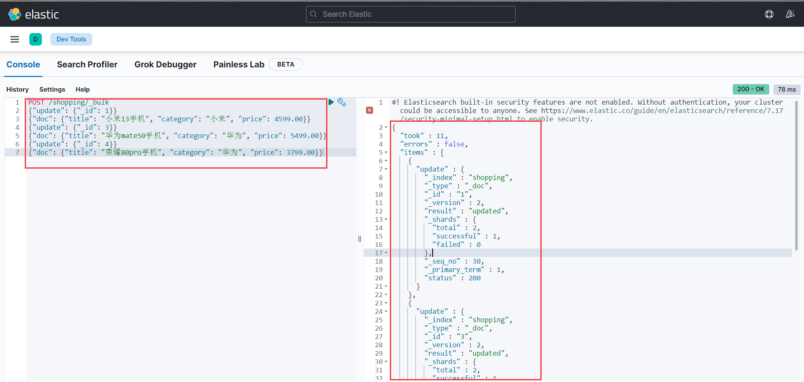
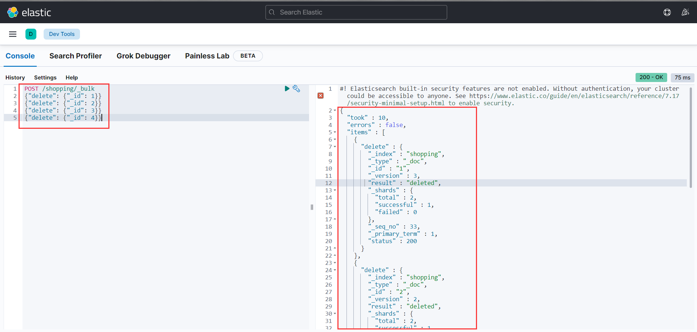
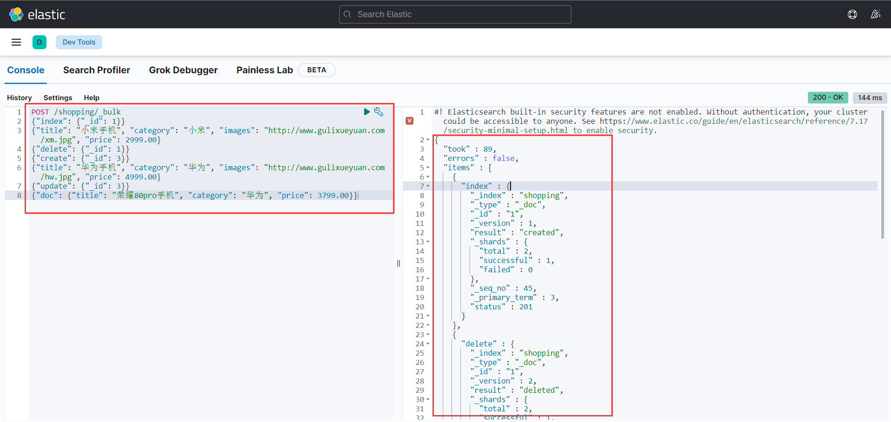

# ElasticSearch 概述

## ElasticSearch 是什么？

在提到 ElasticSearch 之前，我们先来了解一下 Elastic Stack。Elastic Stack 核心产品包括 Elasticsearch、Kibana、Beats 和 Logstash（也称为 ELK
Stack）等等。能够安全可靠地获取任何来源、任何格式的数据，然后实时地对数据进行搜索、分析和可视化。

ElasticSearch，简称为 ES， ES 是一个**基于 JSON 的分布式、RESTFul 风格的搜索和数据分析引擎**，能够解决不断涌现出的各种用例。作为 Elastic Stack 的核心，Elasticsearch
会集中存储数据，可以飞快完成搜索，微调相关性，进行强大的分析，并轻松缩放规模。

它可以近乎实时的存储、检索数据；本身扩展性很好，可以扩展到上百台服务器，处理 PB 级别的数据。

> elastic</br>
> 英 [ɪˈlæstɪk] 美 [ɪˈlæstɪk] </br>
> n. 橡皮圈(或带);松紧带 </br>
> adj. 橡皮圈(或带)的;有弹性的;有弹力的;灵活的;可改变的;可伸缩的

## 全文搜索引擎

Google，百度类的网站搜索，它们都是根据网页中的关键字生成索引，我们在搜索的时候输入关键字，它们会将该关键字即索引匹配到的所有网页返回；还有常见的项目中应用日志的搜索等等。对于这些非结构化的数据文本，关系型数据库搜索不是能很好的支持。

一般传统数据库，全文检索都实现的很鸡肋，因为一般也没人用数据库存文本字段。进行全文检索需要扫描整个表，如果数据量大的话即使对 SQL 的语法优化，也收效甚微。建立了索引，但是维护起来也很麻烦，对于 insert 和 update
操作都会重新构建索引。

基于以上原因可以分析得出，在一些生产环境中，使用常规的搜索方式，性能是非常差的：

- 搜索的数据对象是大量的非结构化的文本数据。
- 文件记录量达到数十万或数百万个甚至更多。
- 支持大量基于交互式文本的查询。
- 需求非常灵活的全文搜索查询。
- 对高度相关的搜索结果的有特殊需求，但是没有可用的关系数据库可以满足。
- 对不同记录类型、非文本数据操作或安全事务处理的需求相对较少的情况。为了解决结构化数据搜索和非结构化数据搜索性能问题，我们就需要专业，健壮，强大的全文搜索引擎。

**这里说到的全文搜索引擎指的是目前广泛应用的主流搜索引擎**
。它的工作原理是计算机索引程序通过扫描文章中的每一个词，对每一个词建立一个索引，指明该词在文章中出现的次数和位置，当用户查询时，检索程序就根据事先建立的索引进行查找，并将查找的结果反馈给用户的检索方式。这个过程类似于通过字典中的检索字表查字的过程。

## ElasticSearch 应用案例

- GitHub: 2013 年初，抛弃了 Solr，采取 Elasticsearch 来做 PB 级的搜索。 “GitHub 使用Elasticsearch 搜索 20TB 的数据，包括 13 亿文件和 1300 亿行代码”。
- 维基百科：启动以 Elasticsearch 为基础的核心搜索架构
- 百度：目前广泛使用 Elasticsearch 作为文本数据分析，采集百度所有服务器上的各类指标数据及用户自定义数据，通过对各种数据进行多维分析展示，辅助定位分析实例异常或业务层面异常。目前覆盖百度内部 20
  多个业务线（包括云分析、网盟、预测、文库、直达号、钱包、 风控等），单集群最大 100 台机器， 200 个 ES 节点，每天导入 30TB+数据。
- 新浪：使用 Elasticsearch 分析处理 32 亿条实时日志。
- 阿里：使用 Elasticsearch 构建日志采集和分析体系。
- Stack Overflow：解决 Bug 问题的网站，全英文，编程人员交流的网站。

# ElasticSearch 环境

## 基础环境搭建

关于 ElasticSearch 环境的搭建，请参考文档：[elasticsearch环境搭建指南](elasticsearch环境搭建指南.md)

## ES-api 请求测试

为了省事，这里以 idea 开发工具中自带的 `HTTP Request` 插件为例进行请求测试（下同），当然你可以选择 [postman](https://www.postman.com/)
或者 [Apifox](https://www.apifox.cn/) 或者其他工具来测试。

- 新建 `http-client.env.json` 文件；

```json
{
  "dev": {
    "baseUrl": "http://127.0.0.1:9200"
  }
}
```

- 新建 `es-api-request.http` 文件

```http request
### 验证 ES 是否成功
GET {{baseUrl}}
```

效果如下图所示：


# ElasticSearch 入门

## 索引

正排索引（传统）

| id   | content              |
|------|----------------------|
| 1001 | my name is zhang san |
| 1002 | my name is li si     |

倒排索引

| keyword | id         |
|---------|------------|
| name    | 1001, 1002 |
| zhang   | 1001       |

ElasticSearch 是**面向文档型数据库**，一条数据在这里就是一个文档。为了方便大家理解，我们将 Elasticsearch 里存储文档数据和关系型数据库 MySQL 存储数据的概念进行一个类比。


ES 里的 `Index` 可以看做一个库，而 `Type` 相当于表， `Documents` 则相当于表的行。这里 `type` 的概念已经被逐渐弱化，ElasticSearch 6.X 中，一个 `index`
下已经只能包含一个 `type`， Elasticsearch 7.X 中, `type` 的概念已经被删除了。

### 创建索引

对比关系型数据库，创建索引就等同于创建数据库。

向 ES 服务器发 PUT 请求：`http://127.0.0.1:9200/shopping`。

```http request
### 创建 shopping 索引
PUT {{baseUrl}}/shopping
```

响应结果：

```text
{
  "acknowledged": true,            // 响应结果
  "shards_acknowledged": true,     // 分片结果
  "index": "shopping"              // 索引名称
}
```

执行日志

```shell
docker logs --tail 10 elasticsearch | grep shopping
```

```text
{"type": "server", "timestamp": "2023-03-15T04:51:04,589Z", "level": "INFO", "component": "o.e.c.m.MetadataCreateIndexService", "cluster.name": "elasticsearch", "node.na
me": "dc5f02585eae", "message": "[shopping] creating index, cause [api], templates [], shards [1]/[1]", "cluster.uuid": "KGA6aFsyQw-LknyvkbAEHQ", "node.id": "ihXicpjjShO
SMitfRzUvRA"  }
```

效果如下图所示：


**注意**：

win 10 下执行 `grep` 命令，会提示如下错误：

```text
grep : 无法将“grep”项识别为 cmdlet、函数、脚本文件或可运行程序的名称。请检查名称的拼写，如果包括路径，请确保路径正确，然后再试一次。
```

出现上述错误，可以尝试安装 `grep` ，安装参考链接：https://www.cnblogs.com/shenxiaolin/p/16662793.html

### 查询索引

#### 查询所有索引

向 ES 服务器发 GET 请求：`http://127.0.0.1:9200/_cat/indices?v`

```http request
### 查询所有索引
GET {{baseUrl}}/_cat/indices?v
```

这里请求路径中的 `_cat` 表示查看的意思， `indices` 表示索引，所以整体含义就是查看当前 ES 服务器中的所有索引，就好像 MySQL 中的 `show tables` 的感觉，服务器响应结果如下：

```text
health status index                           uuid                   pri rep docs.count docs.deleted store.size pri.store.size
green  open   .geoip_databases                m_2rhbeoQQW9xGX2rmdCfA   1   0         42            0     40.7mb         40.7mb
green  open   .apm-custom-link                n-W9098GR0-wGpEt5tvuhA   1   0          0            0       226b           226b
green  open   .kibana_7.17.9_001              g-Qu0wiyRNeHqK_y-W9-sw   1   0        624            1      2.4mb          2.4mb
green  open   .apm-agent-configuration        8ewjD7bCSZCKu5m7SycxkQ   1   0          0            0       226b           226b
green  open   .kibana_task_manager_7.17.9_001 EugcrviHQaKXRPEBd40Qog   1   0         17        24140      2.8mb          2.8mb
yellow open   shopping                        M25FBpYdQN6swLZmkpMBnw   1   1          0            0       226b           226b
green  open   .tasks                          fxZ7WSS9Q_qznYoHcR22VQ   1   0          2            0     13.9kb         13.9kb
```

|      **表头**      |                         **含义**                         |
|:----------------:|:------------------------------------------------------:|
|      health      |  当前服务器健康状态： green(集群完整) yellow(单点正常、集群不完整) red(单点不正常)  |
|      status      |                       索引打开、关闭状态                        |
|      index       |                          索引名                           |
|       uuid       |                         索引统一编号                         |
|       pri        |                         主分片数量                          |
|       rep        |                          副本数量                          |
|    docs.count    |                         可用文档数量                         |
|   docs.deleted   |                      文档删除状态（逻辑删除）                      |
|    store.size    |                     主分片和副分片整体占空间大小                     |
|  pri.store.size  |                        主分片占空间大小                        |

#### 查询单个索引

向 ES 服务器发 GET 请求：`http://127.0.0.1:9200/shopping`

```http request
### 查看单个索引
GET {{baseUrl}}/shopping
```

服务器响应结果如下：

```text
{
  "shopping": { // 索引名
    "aliases": {}, // 别名
    "mappings": {}, // 映射
    "settings": { // 设置
      "index": {  // 设置 - 索引
        "routing": {  // 设置 - 索引 - 路由
          "allocation": {  // 设置 - 索引 - 路由 - 分片
            "include": {  // 分片包含的数据层（节点）首选项
              "_tier_preference": "data_content"
            }
          }
        },
        "number_of_shards": "1", // 设置 - 索引 - 主分片数量
        "provided_name": "shopping",
        "creation_date": "1678855864543", // 设置 - 索引 - 创建时间
        "number_of_replicas": "1", // 设置 - 索引 - 副本数量
        "uuid": "M25FBpYdQN6swLZmkpMBnw", // 设置 - 索引 - 索引统一编号
        "version": {  // 设置 - 索引 - 版本 - 创建
          "created": "7170999"
        }
      }
    }
  }
}
```

### 删除单个索引

向 ES 服务器发 DELETE 请求：`http://127.0.0.1:9200/shopping`

```http request
### 删除单个索引
DELETE {{baseUrl}}/shopping
```

服务器响应结果如下：

```text
{
  "acknowledged": true
}
```

再次查看所有索引，`GET http://127.0.0.1:9200/_cat/indices?v` ，返回结果如下：

```text
health status index                           uuid                   pri rep docs.count docs.deleted store.size pri.store.size
green  open   .geoip_databases                m_2rhbeoQQW9xGX2rmdCfA   1   0         42            0     40.7mb         40.7mb
green  open   .apm-custom-link                n-W9098GR0-wGpEt5tvuhA   1   0          0            0       226b           226b
green  open   .kibana_7.17.9_001              g-Qu0wiyRNeHqK_y-W9-sw   1   0        627           12      2.4mb          2.4mb
green  open   .apm-agent-configuration        8ewjD7bCSZCKu5m7SycxkQ   1   0          0            0       226b           226b
green  open   .kibana_task_manager_7.17.9_001 EugcrviHQaKXRPEBd40Qog   1   0         17        38303      4.1mb          4.1mb
green  open   .tasks                          fxZ7WSS9Q_qznYoHcR22VQ   1   0          2            0     13.9kb         13.9kb
```

根据结果看出 `shopping` 索引已经不存在，说明成功！

## 文档

### 创建文档

这里的文档可以类比为关系型数据库中的表数据，添加的数据格式为 **JSON** 格式。

向 ES 服务器发 POST 请求：`http://127.0.0.1:9200/shopping/_doc` ，请求体 JSON 内容为：

```json
{
  "title": "小米手机",
  "category": "小米",
  "images": "http://www.gulixueyuan.com/xm.jpg",
  "price": 3999.00
}
```

```http request
### 创建文档（此方式不能使用 PUT；自动生成唯一标识，可以指定，比如：xxx/shopping/_doc/1，此方式可以使用 PUT）
POST {{baseUrl}}/shopping/_doc
Content-Type: application/json

{
  "title":"小米手机",
  "category":"小米",
  "images":"http://www.gulixueyuan.com/xm.jpg",
  "price":3999.00
}
```

注意，此处发送请求的方式必须为 POST，不能是 PUT，否则会发生错误，提示的错误如下所示：

```text
{
  "error": "Incorrect HTTP method for uri [/shopping/_doc] and method [PUT], allowed: [POST]",
  "status": 405
}
```

自定义唯一标识这种请求可以使用 PUT，如下所示：

```http request
### 新增文档（当指定唯一标识时可以使用 PUT）
PUT {{baseUrl}}/shopping/_doc/2
Content-Type: application/json

{
  "title":"华为手机",
  "category":"华为",
  "images":"http://www.gulixueyuan.com/hw.jpg",
  "price":4999.00
}
```

服务器响应结果如下：

```text
{
  "_index": "shopping", // 索引
  "_type": "_doc",      // 类型 - 文档
  "_id": "t1eX6IYB1yjqbUaozmwa", // 唯一标识，可以类比为 MySQL 中的主键，随机生成
  "_version": 1,    // 版本
  "result": "created", // 结果，这里的 created 表示创建成功
  "_shards": {      // 分片
    "total": 2,     // 分片 - 总数
    "successful": 1, // 分片 - 成功数
    "failed": 0 // 分片 - 失败数
  },
  "_seq_no": 0, 
  "_primary_term": 1
}
```

上面的数据创建后，由于没有指定数据唯一性标识（ID），默认情况下， ES 服务器会随机生成一个。

如果想要自定义唯一性标识，需要在创建时指定：`http://127.0.0.1:9200/shopping/_doc/1` 。

**注意**：

**如果增加数据时明确数据主键，那么请求方式除了使用 POST 以外，也可以为 PUT**。

### 查询文档

#### 全查询

查看索引下所有数据，向 ES 服务器发 GET 请求：`http://127.0.0.1:9200/shopping/_search`

```http request
### 查询文档（全查询）
GET {{baseUrl}}/shopping/_search
```

服务器响应结果如下：

```text
{
  "took": 9,
  "timed_out": false,
  "_shards": {
    "total": 1,
    "successful": 1,
    "skipped": 0,
    "failed": 0
  },
  "hits": {
    "total": {
      "value": 2,
      "relation": "eq"
    },
    "max_score": 1.0,
    "hits": [
      {
        "_index": "shopping",
        "_type": "_doc",
        "_id": "t1eX6IYB1yjqbUaozmwa",
        "_score": 1.0,
        "_source": {
          "title": "小米手机",
          "category": "小米",
          "images": "http://www.gulixueyuan.com/xm.jpg",
          "price": 3999.00
        }
      },
      {
        "_index": "shopping",
        "_type": "_doc",
        "_id": "1",
        "_score": 1.0,
        "_source": {
          "title": "华为手机",
          "category": "华为",
          "images": "http://www.gulixueyuan.com/hw.jpg",
          "price": 4999.00
        }
      }
    ]
  }
}
```

#### 主键查询

查询文档时，需要指明文档的唯一性标识，类似于 MySQL 中数据的主键查询。

向 ES 服务器发 GET 请求：`http://127.0.0.1:9200/shopping/_doc/1`

```http request
### 查询文档（主键查询）
GET {{baseUrl}}/shopping/_doc/1
```

服务器响应结果如下：

```text
{
  "_index": "shopping",
  "_type": "_doc",
  "_id": "1",
  "_version": 5,
  "_seq_no": 9,
  "_primary_term": 1,
  "found": true,
  "_source": {
    "title": "华为手机",
    "category": "华为",
    "images": "http://www.gulixueyuan.com/hw.jpg",
    "price": 4999.00
  }
}
```

查找不存在的内容，向 ES 服务器发 GET 请求：`http://127.0.0.1:9200/shopping/_doc/1001`

服务器响应结果如下：

```text
{
  "_index": "shopping",
  "_type": "_doc",
  "_id": "1001",
  "found": false    // 为 false 表示未查询到
}
```

### 修改文档

#### 全量修改

和创建文档一样，输入相同的 URL 地址请求，如果请求体变化，会将原有的数据内容覆盖。

向 ES 服务器发 POST 请求：`http://127.0.0.1:9200/shopping/_doc/1` ，请求体 JSON 内容为：

```json
{
  "title": "华为手机",
  "category": "华为",
  "images": "http://www.gulixueyuan.com/hw.jpg",
  "price": 4999.00
}
```

```http request
### 修改文档（全量修改）
PUT {{baseUrl}}/shopping/_doc/1
Content-Type: application/json

{
  "title": "华为手机",
  "category": "华为",
  "images": "http://www.gulixueyuan.com/hw.jpg",
  "price": 4999.00
}
```

服务器响应结果如下：

```text
{
  "_index": "shopping",
  "_type": "_doc",
  "_id": "1",
  "_version": 2,       // 版本号，每次改变都 + 1
  "result": "updated", // 结果，这里的 updated 表示修改成功
  "_shards": {
    "total": 2,
    "successful": 1,
    "failed": 0
  },
  "_seq_no": 5,
  "_primary_term": 1
}
```

#### 局部修改

修改数据时，也可以只修改某一给条数据的局部信息。

向 ES 服务器发 POST 请求：`http://127.0.0.1:9200/shopping/_update/1` ，请求体 JSON 内容为：

```http request
### 修改文档（局部修改）
POST {{baseUrl}}/shopping/_update/1
Content-Type: application/json

{
  "doc": {
    "title": "荣耀手机",
    "category": "华为",
    "price": 1999.00
  }
}
```

**注意**：

**全量修改既可以使用 POST 方式，也可以使用 PUT 方式；局部修改只能使用 POST 方式，不能使用 PUT 方式**。

服务器响应结果如下：

```text
{
  "_index": "shopping",
  "_type": "_doc",
  "_id": "1",
  "_version": 3,
  "result": "updated",
  "_shards": {
    "total": 2,
    "successful": 1,
    "failed": 0
  },
  "_seq_no": 10,
  "_primary_term": 1
}
```

向 ES 服务器发 GET 请求：`http://127.0.0.1:9200/shopping/_doc/1` ，查看修改内容：

```text
{
  "_index": "shopping",
  "_type": "_doc",
  "_id": "1",
  "_version": 16,
  "_seq_no": 20,
  "_primary_term": 1,
  "found": true,
  "_source": {
    "title": "荣耀手机",
    "category": "华为",
    "images": "http://www.gulixueyuan.com/hw.jpg",
    "price": 1999.0
  }
}
```

### 删除文档

删除一个文档不会立即从磁盘上移除，它只是被标记成已删除（逻辑删除）。

向 ES 服务器发 DELETE 请求：`http://127.0.0.1:9200/shopping/_doc/1`

```http request
### 删除文档（逻辑删除）
DELETE {{baseUrl}}/shopping/_doc/1
```

服务器响应结果如下：

```text
{
  "_index": "shopping",
  "_type": "_doc",
  "_id": "1",
  "_version": 4,
  "result": "deleted", // 结果，这里的 deleted 表示删除成功，这里是逻辑删除
  "_shards": {
    "total": 2,
    "successful": 1,
    "failed": 0
  },
  "_seq_no": 21,
  "_primary_term": 1
}
```

向 ES 服务器发 GET 请求：`http://127.0.0.1:9200/shopping/_doc/1` ，查看是否删除成功：

```text
{
  "_index": "shopping",
  "_type": "_doc",
  "_id": "1",
  "found": false
}
```

### 批量操作文档

提到批量操作文档，我们需要使用到 `bulk` **批量增删改**的操作
API。官方说明：[docs-bulk](https://www.elastic.co/guide/en/elasticsearch/reference/7.17/docs-bulk.html)

1. 语法

`bulk` 对 JSON 串的有着严格的要求。**每个 JSON 串不能换行，只能放在同一行**。同时，**相邻的 JSON 串之间必须要有换行**（Linux 下是 `\n`；Window 下是 `\r\n`）。bulk
的每个操作必须要一对 JSON 串（delete 语法除外）。

```text
action_and_meta_data\n
optional_source\n
action_and_meta_data\n
optional_source\n
....
action_and_meta_data\n
optional_source\n
```

**注意**：

最后一行数据必须以换行符 `\n` 结束。每个换行符前可以加回车 `\r`。将 `NDJSON` 数据发送到 `_bulk` 端点时，请使用 `application/json` 或 `application/x-ndjson`
的 `Content-Type` 标头。

2. 操作类型

- `create` 如果文档不存在就创建，但如果文档存在就返回错误；
- `index` 如果文档不存在就创建，如果文档存在就更新；
- `update` 更新一个文档，如果文档不存在就返回错误；
- `delete` 删除一个文档，如果要删除的文档id不存在，就返回错误。

其实可以看得出来 index 是比较常用的。还有 bulk 的操作，某一个操作失败，是不会影响其他文档的操作的，它会在返回结果中告诉你失败的详细的原因。

3. 操作请求

请求方式

- `POST /_bulk`

如果使用此方式，需要在元数据中指定索引，也就是 `"_index": "index_name"`，如下所示：

```text
POST _bulk
{ "index" : { "_index" : "test", "_id" : "1" } }
{ "field1" : "value1" }
{ "delete" : { "_index" : "test", "_id" : "2" } }
{ "create" : { "_index" : "test", "_id" : "3" } }
{ "field1" : "value3" }
{ "update" : {"_id" : "1", "_index" : "test"} }
{ "doc" : {"field2" : "value2"} }
```

- `POST /<target>/_bulk`

如果使用此方式，不需要在元数据中指定索引，也就是 `target` 处为索引，所以不需要指定，如下所示：

```text
POST /index_name/_bulk
{ "index" : {"_id" : "1" } }
{ "field1" : "value1" }
{ "delete" : { "_id" : "2" } }
{ "create" : {"_id" : "3" } }
{ "field1" : "value3" }
{ "update" : {"_id" : "1"} }
{ "doc" : {"field2" : "value2"} }
```

4. 操作工具

关于批量操作，我这里选择使用 kibana 的 `dev_tools`
终端控制台来操作（下同），在线测试地址：[http://localhost:5601/app/dev_tools#/console](http://localhost:5601/app/dev_tools#/console)

由于 idea 中的 HTTP Request 插件没有找到方法进行测试批量操作，这里主要采用 kibana 的 `dev_tools`，或者使用 Apifox 工具进行测试。

如下图所示：


4. 官方测试集

测试集地址：[https://download.elastic.co/demos/kibana/gettingstarted/accounts.zip](https://download.elastic.co/demos/kibana/gettingstarted/accounts.zip)

#### 批量新增

新增的 `action` 为 `index` 或者 `create`，这里选择 `index` 。

```text
POST /shopping/_bulk
{"index": {"_id": 1}}
{"title": "小米手机", "category": "小米", "images": "http://www.gulixueyuan.com/xm.jpg", "price": 2999.00}
{"index": {"_id": 2}}
{"title": "红米手机", "category": "小米", "images": "http://www.gulixueyuan.com/xm.jpg", "price": 1999.00}
{"index": {"_id": 3}}
{"title": "华为手机", "category": "华为", "images": "http://www.gulixueyuan.com/hw.jpg", "price": 4999.00}
{"index": {"_id": 4}}
{"title": "荣耀手机", "category": "华为", "images": "http://www.gulixueyuan.com/hw.jpg", "price": 1999.00}
```

服务器响应结果如下：

```json
{
  "took": 6,
  "errors": false,
  "items": [
    {
      "index": {
        "_index": "shopping",
        "_type": "_doc",
        "_id": "1",
        "_version": 1,
        "result": "created",
        "_shards": {
          "total": 2,
          "successful": 1,
          "failed": 0
        },
        "_seq_no": 37,
        "_primary_term": 1,
        "status": 201
      }
    },
    {
      "index": {
        "_index": "shopping",
        "_type": "_doc",
        "_id": "2",
        "_version": 1,
        "result": "created",
        "_shards": {
          "total": 2,
          "successful": 1,
          "failed": 0
        },
        "_seq_no": 38,
        "_primary_term": 1,
        "status": 201
      }
    },
    {
      "index": {
        "_index": "shopping",
        "_type": "_doc",
        "_id": "3",
        "_version": 1,
        "result": "created",
        "_shards": {
          "total": 2,
          "successful": 1,
          "failed": 0
        },
        "_seq_no": 39,
        "_primary_term": 1,
        "status": 201
      }
    },
    {
      "index": {
        "_index": "shopping",
        "_type": "_doc",
        "_id": "4",
        "_version": 1,
        "result": "created",
        "_shards": {
          "total": 2,
          "successful": 1,
          "failed": 0
        },
        "_seq_no": 40,
        "_primary_term": 1,
        "status": 201
      }
    }
  ]
}
```


#### 批量修改

修改的 `action` 为 `update` 。

```text
POST /shopping/_bulk
{"update": {"_id": 1}}
{"doc": {"title": "小米13手机", "category": "小米", "price": 4599.00}}
{"update": {"_id": 3}}
{"doc": {"title": "华为mate50手机", "category": "华为", "price": 5499.00}}
{"update": {"_id": 4}}
{"doc": {"title": "荣耀80pro手机", "category": "华为", "price": 3799.00}}
```

服务器响应结果如下：

```json
{
  "took": 11,
  "errors": false,
  "items": [
    {
      "update": {
        "_index": "shopping",
        "_type": "_doc",
        "_id": "1",
        "_version": 2,
        "result": "updated",
        "_shards": {
          "total": 2,
          "successful": 1,
          "failed": 0
        },
        "_seq_no": 30,
        "_primary_term": 1,
        "status": 200
      }
    },
    {
      "update": {
        "_index": "shopping",
        "_type": "_doc",
        "_id": "3",
        "_version": 2,
        "result": "updated",
        "_shards": {
          "total": 2,
          "successful": 1,
          "failed": 0
        },
        "_seq_no": 31,
        "_primary_term": 1,
        "status": 200
      }
    },
    {
      "update": {
        "_index": "shopping",
        "_type": "_doc",
        "_id": "4",
        "_version": 2,
        "result": "updated",
        "_shards": {
          "total": 2,
          "successful": 1,
          "failed": 0
        },
        "_seq_no": 32,
        "_primary_term": 1,
        "status": 200
      }
    }
  ]
}
```



#### 批量删除

修改的 `action` 为 `delete` 。

```text
POST /shopping/_bulk
{"delete": {"_id": 1}}
{"delete": {"_id": 2}}
{"delete": {"_id": 3}}
{"delete": {"_id": 4}}
```

服务器响应结果如下：

```json
{
  "took": 10,
  "errors": false,
  "items": [
    {
      "delete": {
        "_index": "shopping",
        "_type": "_doc",
        "_id": "1",
        "_version": 3,
        "result": "deleted",
        "_shards": {
          "total": 2,
          "successful": 1,
          "failed": 0
        },
        "_seq_no": 33,
        "_primary_term": 1,
        "status": 200
      }
    },
    {
      "delete": {
        "_index": "shopping",
        "_type": "_doc",
        "_id": "2",
        "_version": 2,
        "result": "deleted",
        "_shards": {
          "total": 2,
          "successful": 1,
          "failed": 0
        },
        "_seq_no": 34,
        "_primary_term": 1,
        "status": 200
      }
    },
    {
      "delete": {
        "_index": "shopping",
        "_type": "_doc",
        "_id": "3",
        "_version": 3,
        "result": "deleted",
        "_shards": {
          "total": 2,
          "successful": 1,
          "failed": 0
        },
        "_seq_no": 35,
        "_primary_term": 1,
        "status": 200
      }
    },
    {
      "delete": {
        "_index": "shopping",
        "_type": "_doc",
        "_id": "4",
        "_version": 3,
        "result": "deleted",
        "_shards": {
          "total": 2,
          "successful": 1,
          "failed": 0
        },
        "_seq_no": 36,
        "_primary_term": 1,
        "status": 200
      }
    }
  ]
}
```



#### 批量的混合操作

不过一般不推荐这种使用，项目中也用的极少。

```text
POST /shopping/_bulk
{"index": {"_id": 1}}
{"title": "小米手机", "category": "小米", "images": "http://www.gulixueyuan.com/xm.jpg", "price": 2999.00}
{"delete": {"_id": 1}}
{"create": {"_id": 3}}
{"title": "华为手机", "category": "华为", "images": "http://www.gulixueyuan.com/hw.jpg", "price": 4999.00}
{"update": {"_id": 3}}
{"doc": {"title": "荣耀80pro手机", "category": "华为", "price": 3799.00}}
```

服务器响应结果如下：

```json
{
  "took": 89,
  "errors": false,
  "items": [
    {
      "index": {
        "_index": "shopping",
        "_type": "_doc",
        "_id": "1",
        "_version": 1,
        "result": "created",
        "_shards": {
          "total": 2,
          "successful": 1,
          "failed": 0
        },
        "_seq_no": 45,
        "_primary_term": 3,
        "status": 201
      }
    },
    {
      "delete": {
        "_index": "shopping",
        "_type": "_doc",
        "_id": "1",
        "_version": 2,
        "result": "deleted",
        "_shards": {
          "total": 2,
          "successful": 1,
          "failed": 0
        },
        "_seq_no": 46,
        "_primary_term": 3,
        "status": 200
      }
    },
    {
      "create": {
        "_index": "shopping",
        "_type": "_doc",
        "_id": "3",
        "_version": 1,
        "result": "created",
        "_shards": {
          "total": 2,
          "successful": 1,
          "failed": 0
        },
        "_seq_no": 47,
        "_primary_term": 3,
        "status": 201
      }
    },
    {
      "update": {
        "_index": "shopping",
        "_type": "_doc",
        "_id": "3",
        "_version": 2,
        "result": "updated",
        "_shards": {
          "total": 2,
          "successful": 1,
          "failed": 0
        },
        "_seq_no": 48,
        "_primary_term": 3,
        "status": 200
      }
    }
  ]
}
```



## 查询

### 条件查询

准备 4 条数据，可以使用 [batch-create](../elasticsearch-service/src/main/resources/dataset/bulk/batch-create.json) 脚本新增数据；

#### URL 带参查询

查询的条件为：“查找 category 为小米的文档”，向 ES 服务器发 GET请求：`http://127.0.0.1:9200/shopping/_search?q=category:小米`

```text
### 条件查询（URL带参查询）
GET {{baseUrl}}/shopping/_search?q=category:小米
```

服务器响应结果如下：

```json
{
  "took": 7,
  "timed_out": false,
  "_shards": {
    "total": 1,
    "successful": 1,
    "skipped": 0,
    "failed": 0
  },
  "hits": {
    "total": {
      "value": 2,
      "relation": "eq"
    },
    "max_score": 1.3862942,
    "hits": [
      {
        "_index": "shopping",
        "_type": "_doc",
        "_id": "1",
        "_score": 1.3862942,
        "_source": {
          "title": "小米手机",
          "category": "小米",
          "images": "http://www.gulixueyuan.com/xm.jpg",
          "price": 2999.00
        }
      },
      {
        "_index": "shopping",
        "_type": "_doc",
        "_id": "2",
        "_score": 1.3862942,
        "_source": {
          "title": "红米手机",
          "category": "小米",
          "images": "http://www.gulixueyuan.com/xm.jpg",
          "price": 1999.00
        }
      }
    ]
  }
}
```

上述为 URL 带参数形式查询，这很容易让不善者心怀恶意，或者参数值出现中文会出现乱码情况。为了避免这些情况，我们可用使用带 JSON 请求体请求进行查询。

#### 请求体带参查询

查询的条件为：“查找 category 为华为的文档”，向 ES 服务器发 GET请求：`http://127.0.0.1:9200/shopping/_search` ，JSON 请求体内容如下：

```json
{
  "query": {
    "match": {
      "category": "华为"
    }
  }
}
```

```text
### 条件查询（请求体带参查询）
GET {{baseUrl}}/shopping/_search
Content-Type: application/json

{
  "query": {
    "match": {
      "category": "华为"
    }
  }
}
```

服务器响应结果如下：

```json
{
  "took": 1,
  "timed_out": false,
  "_shards": {
    "total": 1,
    "successful": 1,
    "skipped": 0,
    "failed": 0
  },
  "hits": {
    "total": {
      "value": 2,
      "relation": "eq"
    },
    "max_score": 1.3862942,
    "hits": [
      {
        "_index": "shopping",
        "_type": "_doc",
        "_id": "3",
        "_score": 1.3862942,
        "_source": {
          "title": "华为手机",
          "category": "华为",
          "images": "http://www.gulixueyuan.com/hw.jpg",
          "price": 4999.00
        }
      },
      {
        "_index": "shopping",
        "_type": "_doc",
        "_id": "4",
        "_score": 1.3862942,
        "_source": {
          "title": "荣耀手机",
          "category": "华为",
          "images": "http://www.gulixueyuan.com/hw.jpg",
          "price": 1999.00
        }
      }
    ]
  }
}
```

#### 请求体查询所有内容

查找所有文档内容，向 ES 服务器发 GET请求：http://127.0.0.1:9200/shopping/_search ，JSON 请求体如下：

```json
{
  "query": {
    "match_all": {}
  }
}
```

```text
### 请求体查询所有
GET {{baseUrl}}/shopping/_search
Content-Type: application/json

{
  "query": {
    "match_all": {}
  }
}
```

服务器响应结果如下：

```json
{
  "took": 0,
  "timed_out": false,
  "_shards": {
    "total": 1,
    "successful": 1,
    "skipped": 0,
    "failed": 0
  },
  "hits": {
    "total": {
      "value": 4,
      "relation": "eq"
    },
    "max_score": 1.0,
    "hits": [
      {
        "_index": "shopping",
        "_type": "_doc",
        "_id": "1",
        "_score": 1.0,
        "_source": {
          "title": "小米手机",
          "category": "小米",
          "images": "http://www.gulixueyuan.com/xm.jpg",
          "price": 2999.00
        }
      },
      {
        "_index": "shopping",
        "_type": "_doc",
        "_id": "2",
        "_score": 1.0,
        "_source": {
          "title": "红米手机",
          "category": "小米",
          "images": "http://www.gulixueyuan.com/xm.jpg",
          "price": 1999.00
        }
      },
      {
        "_index": "shopping",
        "_type": "_doc",
        "_id": "3",
        "_score": 1.0,
        "_source": {
          "title": "华为手机",
          "category": "华为",
          "images": "http://www.gulixueyuan.com/hw.jpg",
          "price": 4999.00
        }
      },
      {
        "_index": "shopping",
        "_type": "_doc",
        "_id": "4",
        "_score": 1.0,
        "_source": {
          "title": "荣耀手机",
          "category": "华为",
          "images": "http://www.gulixueyuan.com/hw.jpg",
          "price": 1999.00
        }
      }
    ]
  }
}
```

#### 查询指定字段的所有内容

这里是查询指定字段，是返回所有指定字段查询的数据，向 ES 服务器发 GET 请求：`http://127.0.0.1:9200/shopping/_search` ，JSON 请求体如下：

```json
{
  "query": {
    "match_all": {}
  },
  "_source": [
    "title"
  ]
}
```

```text
### 查询指定字段的所有内容
GET {{baseUrl}}/shopping/_search
Content-Type: application/json

{
  "query": {
    "match_all": {}
  },
  "_source": ["title"]
}
```

服务器响应结果如下：

```text
{
  "took": 0,
  "timed_out": false,
  "_shards": {
    "total": 1,
    "successful": 1,
    "skipped": 0,
    "failed": 0
  },
  "hits": {
    "total": {
      "value": 4,
      "relation": "eq"
    },
    "max_score": 1.0,
    "hits": [
      {
        "_index": "shopping",
        "_type": "_doc",
        "_id": "1",
        "_score": 1.0,
        "_source": {
          "title": "小米手机"
        }
      },
      {
        "_index": "shopping",
        "_type": "_doc",
        "_id": "2",
        "_score": 1.0,
        "_source": {
          "title": "红米手机"
        }
      },
      {
        "_index": "shopping",
        "_type": "_doc",
        "_id": "3",
        "_score": 1.0,
        "_source": {
          "title": "华为手机"
        }
      },
      {
        "_index": "shopping",
        "_type": "_doc",
        "_id": "4",
        "_score": 1.0,
        "_source": {
          "title": "荣耀手机"
        }
      }
    ]
  }
}
```

### 分页查询

#### from + size 浅分页

"浅"分页可以理解为简单意义上的分页。它的原理很简单，就是查询前 20 条数据，然后截断前 10 条，只返回 10-20 的数据。这样其实白白浪费了前 10 条的查询。

向 ES 服务器发 GET请求：`http://127.0.0.1:9200/shopping/_search` ，JSON 请求体如下：

```json
{
  "query": {
    "match_all": {}
  },
  "from": 0,
  "size": 2
}
```

> **说明**
>
> 其中，`from` 定义了目标数据的偏移值，`size` 定义当前返回的数目。默认 `from` 为 0，`size` 为 2，即所有的查询默认仅仅返回前 2 条数据。

服务器响应结果如下：

```json
{
  "took": 299,
  "timed_out": false,
  "_shards": {
    "total": 1,
    "successful": 1,
    "skipped": 0,
    "failed": 0
  },
  "hits": {
    "total": {
      "value": 4,
      "relation": "eq"
    },
    "max_score": 1.0,
    "hits": [
      {
        "_index": "shopping",
        "_type": "_doc",
        "_id": "3",
        "_score": 1.0,
        "_source": {
          "title": "华为手机",
          "category": "华为",
          "images": "http://www.gulixueyuan.com/hw.jpg",
          "price": 4999.00
        }
      },
      {
        "_index": "shopping",
        "_type": "_doc",
        "_id": "4",
        "_score": 1.0,
        "_source": {
          "title": "荣耀手机",
          "category": "华为",
          "images": "http://www.gulixueyuan.com/hw.jpg",
          "price": 1999.00
        }
      }
    ]
  }
}
```

> **扩展**
>
> **在这里有必要了解一下 from/size 的原理：**
>
> 因为 es 是基于分片的，假设有 5 个分片，`from=100,size=10`。则会根据排序规则从 5 个分片中各取回 100 条数据数据，然后汇总成 500 条数据后选择最后面的 10 条数据。
>
> 做过测试，越往后的分页，执行的效率越低。总体上会随着 from 的增加，消耗时间也会增加。而且数据量越大，就越明显！

#### scroll 深分页

`from + size` 查询在 10000-50000 条数据（1000 到 5000 页）以内的时候还是可以的，但是如果数据过多的话，就会出现**深分页**问题。

为了解决上面的问题，elasticsearch 提出了一个 `scroll` 滚动的方式。

`scroll` 类似于 `sql` 中的 `cursor`，使用 `scroll`，每次只能获取一页的内容，然后会返回一个 `scroll_id`。根据返回的这个 scroll_id 可以不断地获取下一页的内容，**所以 scroll 并不适用于有跳页的情景**。

向 ES 服务器发 GET请求：`http://127.0.0.1:9200/shopping/_search?scroll=1m` ，JSON 请求体如下：

```json
{
  "query": {
    "match_all": {}
  },
  "from": 0,
  "size": 2
}
```

> **说明**
>
> 1. `scroll=1m` 表示 `scroll_id` 保留 `1` 分钟可用；
> 2. 使用 `scroll` 必须要将 `from` 设置为 `0`；
> 3. `size` 决定后面每次调用 `_search` 搜索返回的数量

服务器响应结果如下：

```json
{
  "_scroll_id": "FGluY2x1ZGVfY29udGV4dF91dWlkDXF1ZXJ5QW5kRmV0Y2gBFm0zTUU4WHA2UUJDbnlPakt3SlV4Z2cAAAAAAANTSRZpaFhpY3BqalNoT1NNaXRmUnpVdlJB",
  "took": 436,
  "timed_out": false,
  "_shards": {
    "total": 1,
    "successful": 1,
    "skipped": 0,
    "failed": 0
  },
  "hits": {
    "total": {
      "value": 4,
      "relation": "eq"
    },
    "max_score": 1.0,
    "hits": [
      {
        "_index": "shopping",
        "_type": "_doc",
        "_id": "1",
        "_score": 1.0,
        "_source": {
          "title": "小米手机",
          "category": "小米",
          "images": "http://www.gulixueyuan.com/xm.jpg",
          "price": 2999.00
        }
      },
      {
        "_index": "shopping",
        "_type": "_doc",
        "_id": "2",
        "_score": 1.0,
        "_source": {
          "title": "红米手机",
          "category": "小米",
          "images": "http://www.gulixueyuan.com/xm.jpg",
          "price": 1999.00
        }
      }
    ]
  }
}
```

然后我们可以通过数据返回的 `_scroll_id` 读取下一页内容，每次请求将会读取下 `2` 条（一开始 `size` 设置的为 `2`）数据，直到数据读取完毕或者 `scroll_id` 保留时间截止（也就是 `"scroll": "5m"`），示例代码如下：

```http request
### 分页查询（查询 scroll 下一页数据）
GET {{baseUrl}}/_search/scroll
Content-Type: application/json

{
  "scroll_id": "FGluY2x1ZGVfY29udGV4dF91dWlkDXF1ZXJ5QW5kRmV0Y2gBFm0zTUU4WHA2UUJDbnlPakt3SlV4Z2cAAAAAAANWHhZpaFhpY3BqalNoT1NNaXRmUnpVdlJB",
  "scroll": "5m"
}
```

> **注意**
>
> 请求的接口不再使用索引名了，而是 `_search/scroll`，其中 `GET` 和 `POST` 方法都可以使用。

##### scroll 深分页删除

根据官方文档的说法，`scroll` 的搜索上下文会在 `scroll` 的保留时间截止后自动清除，但是我们知道 `scroll` 是非常消耗资源的，所以一个建议就是当不需要了 `scroll` 数据的时候，尽可能快的把 `scroll_id` 显式删除掉。

- 清除指定的 `scroll_id`
```http request
DELETE {{baseUrl}}/_search/scroll/FGluY2x1ZGVfY29udGV...
```

- 清除所有的 scroll
```http request
DELETE {{baseUrl}}/_search/scroll/_all
```

#### search_after 深分页

`scroll` 的方式，官方的建议不用于实时的请求（一般用于数据导出），因为每一个 `scroll_id` 不仅会占用大量的资源，而且会生成历史快照，对于数据的变更不会反映到快照上。

`search_after` 分页的方式是根据上一页的最后一条数据来确定下一页的位置，同时在分页请求的过程中，如果有索引数据的增删改查，这些变更也会实时的反映到游标上。但是需要注意，因为每一页的数据依赖于上一页最后一条数据，所以无法跳页请求。

**为了找到每一页最后一条数据，每个文档必须有一个全局唯一值，官方推荐使用 `_uid` 作为全局唯一值**，其实使用业务层的 `id` 也可以。

```http request
### search_after 深分页
GET {{baseUrl}}/shopping/_search
Content-Type: application/json

{
  "query": {
    "match_all": {}
  },
  "from": 0,
  "size": 2,
  "sort": [
    {
      "_id": {
        "order": "desc"
      }
    }
  ]
}
```

服务器响应结果如下：

```json
{
  "took": 10,
  "timed_out": false,
  "_shards": {
    "total": 1,
    "successful": 1,
    "skipped": 0,
    "failed": 0
  },
  "hits": {
    "total": {
      "value": 4,
      "relation": "eq"
    },
    "max_score": null,
    "hits": [
      {
        "_index": "shopping",
        "_type": "_doc",
        "_id": "4",
        "_score": null,
        "_source": {
          "title": "荣耀手机",
          "category": "华为",
          "images": "http://www.gulixueyuan.com/hw.jpg",
          "price": 1999.00
        },
        "sort": [
          "4"
        ]
      },
      {
        "_index": "shopping",
        "_type": "_doc",
        "_id": "3",
        "_score": null,
        "_source": {
          "title": "华为手机",
          "category": "华为",
          "images": "http://www.gulixueyuan.com/hw.jpg",
          "price": 4999.00
        },
        "sort": [
          "3"
        ]
      }
    ]
  }
}
```

> **注意**
>
> 1. 使用 `search_after` 必须要设置 `from=0`；
> 2. 这里我使用 `timestamp` 和 `_id` 作为唯一值排序；
> 3. 我们在返回的最后一条数据里拿到 `sort` 属性的值传入到 `search_after`。

使用 `sort` 返回的值搜索下一页

```http request
### search_after 深分页，查询下一页数据
GET {{baseUrl}}/shopping/_search
Content-Type: application/json

{
  "query": {
    "match_all": {}
  },
  "from": 0,
  "size": 2,
  "search_after": [
    3
  ],
  "sort": [
    {
      "_id": {
        "order": "desc"
      }
    }
  ]
}
```

#### 三种分页对比

| 分页方式           | 	性能 | 	优点                       | 	缺点                                             | 	场景                 |
|----------------|-----|---------------------------|-------------------------------------------------|---------------------|
| `from + size`  | 低   | 灵活性好，实现简单                 | 	深度分页问题	                                        | 数据量比较小，能容忍深度分页问题    |
| `scroll`	      | 中   | 	解决了深度分页问题	               | 无法反应数据的实时性（快照版本）维护成本高，需要维护一个 scroll_id	         | 海量数据的导出需要查询海量结果集的数据 |
| `search_after` | 高   | 性能最好不存在深度分页问题能够反映数据的实时变更	 | 实现复杂，需要有一个全局唯一的字段连续分页的实现会比较复杂，因为每一次查询都需要上次查询的结果 | 	海量数据的分页            |

### 查询排序

如果你想通过排序查出价格最高的手机，向 ES 服务器发 GET 请求：`http://127.0.0.1:9200/shopping/_search` ，请求如下：

```http request
### 查询排序
GET {{baseUrl}}/shopping/_search
Content-Type: application/json

{
  "query":{
    "match_all":{}
  },
  "sort":{
    "price":{
      "order":"desc"
    }
  }
}
```

服务器响应结果如下：

```json
{
  "took": 9,
  "timed_out": false,
  "_shards": {
    "total": 1,
    "successful": 1,
    "skipped": 0,
    "failed": 0
  },
  "hits": {
    "total": {
      "value": 4,
      "relation": "eq"
    },
    "max_score": null,
    "hits": [
      {
        "_index": "shopping",
        "_type": "_doc",
        "_id": "3",
        "_score": null,
        "_source": {
          "title": "华为手机",
          "category": "华为",
          "images": "http://www.gulixueyuan.com/hw.jpg",
          "price": 4999.00
        },
        "sort": [
          4999.0
        ]
      },
      {
        "_index": "shopping",
        "_type": "_doc",
        "_id": "1",
        "_score": null,
        "_source": {
          "title": "小米手机",
          "category": "小米",
          "images": "http://www.gulixueyuan.com/xm.jpg",
          "price": 2999.00
        },
        "sort": [
          2999.0
        ]
      },
      {
        "_index": "shopping",
        "_type": "_doc",
        "_id": "2",
        "_score": null,
        "_source": {
          "title": "红米手机",
          "category": "小米",
          "images": "http://www.gulixueyuan.com/xm.jpg",
          "price": 1999.00
        },
        "sort": [
          1999.0
        ]
      },
      {
        "_index": "shopping",
        "_type": "_doc",
        "_id": "4",
        "_score": null,
        "_source": {
          "title": "荣耀手机",
          "category": "华为",
          "images": "http://www.gulixueyuan.com/hw.jpg",
          "price": 1999.00
        },
        "sort": [
          1999.0
        ]
      }
    ]
  }
}
```

### 多条件查询

#### `must` 多条件查询

假设想查询**华为**牌子，**同时**价格为 **4999** 元的手机信息。这里需要借助 `must` 字段，相当于编程语言中的 `&&` 与条件。

向 ES 服务器发 GET 请求：`http://127.0.0.1:9200/shopping/_search` ，请求如下：

```http request
### 多条件查询
GET {{baseUrl}}/shopping/_search
Content-Type: application/json

{
  "query":{
    "bool":{
      "must":[{
        "match":{
          "category":"华为"
        }
      },{
        "match":{
          "price":4999.00
        }
      }]
    }
  }
}
```

服务器响应结果如下：

```json
{
  "took": 10,
  "timed_out": false,
  "_shards": {
    "total": 1,
    "successful": 1,
    "skipped": 0,
    "failed": 0
  },
  "hits": {
    "total": {
      "value": 1,
      "relation": "eq"
    },
    "max_score": 2.3862944,
    "hits": [
      {
        "_index": "shopping",
        "_type": "_doc",
        "_id": "3",
        "_score": 2.3862944,
        "_source": {
          "title": "华为手机",
          "category": "华为",
          "images": "http://www.gulixueyuan.com/hw.jpg",
          "price": 4999.00
        }
      }
    ]
  }
}
```

#### `should` 多条件查询

假设想查询类别为**华为**牌子，**或者**类别为**小米**牌子的手机信息。这里需要借助 `should` 字段，相当于编程语言中的 `||` 或条件。

向 ES 服务器发 GET 请求：`http://127.0.0.1:9200/shopping/_search` ，请求如下：

```http request
### 多条件查询（should 多条件查询）
GET {{baseUrl}}/shopping/_search
Content-Type: application/json

{
  "query":{
    "bool":{
      "should":[{
        "match":{
          "category":"小米"
        }
      },{
        "match":{
          "category":"华为"
        }
      }]
    }
  }
}
```

服务器响应结果如下：

```json
{
  "took": 1,
  "timed_out": false,
  "_shards": {
    "total": 1,
    "successful": 1,
    "skipped": 0,
    "failed": 0
  },
  "hits": {
    "total": {
      "value": 4,
      "relation": "eq"
    },
    "max_score": 1.3862942,
    "hits": [
      {
        "_index": "shopping",
        "_type": "_doc",
        "_id": "1",
        "_score": 1.3862942,
        "_source": {
          "title": "小米手机",
          "category": "小米",
          "images": "http://www.gulixueyuan.com/xm.jpg",
          "price": 2999.00
        }
      },
      {
        "_index": "shopping",
        "_type": "_doc",
        "_id": "2",
        "_score": 1.3862942,
        "_source": {
          "title": "红米手机",
          "category": "小米",
          "images": "http://www.gulixueyuan.com/xm.jpg",
          "price": 1999.00
        }
      },
      {
        "_index": "shopping",
        "_type": "_doc",
        "_id": "3",
        "_score": 1.3862942,
        "_source": {
          "title": "华为手机",
          "category": "华为",
          "images": "http://www.gulixueyuan.com/hw.jpg",
          "price": 4999.00
        }
      },
      {
        "_index": "shopping",
        "_type": "_doc",
        "_id": "4",
        "_score": 1.3862942,
        "_source": {
          "title": "荣耀手机",
          "category": "华为",
          "images": "http://www.gulixueyuan.com/hw.jpg",
          "price": 1999.00
        }
      }
    ]
  }
}
```

### 范围查询

假设想查询**小米**和**华为**的牌子，**价格大于 2000 元**的手机。

向 ES 服务器发 GET 请求：`http://127.0.0.1:9200/shopping/_search` ，请求如下：

```http request
### 范围查询
GET {{baseUrl}}/shopping/_search
Content-Type: application/json

{
  "query":{
    "bool":{
      "should":[{
        "match":{
          "category":"小米"
        }
      },{
        "match":{
          "category":"华为"
        }
      }],
      "filter":{
        "range":{
          "price":{
            "gt": 2000
          }
        }
      }
    }
  }
}
```

服务器响应结果如下：

```json
{
  "took": 2,
  "timed_out": false,
  "_shards": {
    "total": 1,
    "successful": 1,
    "skipped": 0,
    "failed": 0
  },
  "hits": {
    "total": {
      "value": 2,
      "relation": "eq"
    },
    "max_score": 1.3862942,
    "hits": [
      {
        "_index": "shopping",
        "_type": "_doc",
        "_id": "1",
        "_score": 1.3862942,
        "_source": {
          "title": "小米手机",
          "category": "小米",
          "images": "http://www.gulixueyuan.com/xm.jpg",
          "price": 2999.00
        }
      },
      {
        "_index": "shopping",
        "_type": "_doc",
        "_id": "3",
        "_score": 1.3862942,
        "_source": {
          "title": "华为手机",
          "category": "华为",
          "images": "http://www.gulixueyuan.com/hw.jpg",
          "price": 4999.00
        }
      }
    ]
  }
}
```

### 全文检索

这功能像搜索引擎那样，如品牌输入“小华”，返回结果带回品牌有“小米”和”华为“的信息。

向 ES 服务器发 GET 请求：`http://127.0.0.1:9200/shopping/_search` ，请求如下：

```http request
### 全文检索
GET {{baseUrl}}/shopping/_search
Content-Type: application/json

{
  "query":{
    "match":{
      "category" : "小华"
    }
  }
}
```

服务器响应结果如下：

```json
{
  "took": 1,
  "timed_out": false,
  "_shards": {
    "total": 1,
    "successful": 1,
    "skipped": 0,
    "failed": 0
  },
  "hits": {
    "total": {
      "value": 4,
      "relation": "eq"
    },
    "max_score": 0.6931471,
    "hits": [
      {
        "_index": "shopping",
        "_type": "_doc",
        "_id": "1",
        "_score": 0.6931471,
        "_source": {
          "title": "小米手机",
          "category": "小米",
          "images": "http://www.gulixueyuan.com/xm.jpg",
          "price": 2999.00
        }
      },
      {
        "_index": "shopping",
        "_type": "_doc",
        "_id": "2",
        "_score": 0.6931471,
        "_source": {
          "title": "红米手机",
          "category": "小米",
          "images": "http://www.gulixueyuan.com/xm.jpg",
          "price": 1999.00
        }
      },
      {
        "_index": "shopping",
        "_type": "_doc",
        "_id": "3",
        "_score": 0.6931471,
        "_source": {
          "title": "华为手机",
          "category": "华为",
          "images": "http://www.gulixueyuan.com/hw.jpg",
          "price": 4999.00
        }
      },
      {
        "_index": "shopping",
        "_type": "_doc",
        "_id": "4",
        "_score": 0.6931471,
        "_source": {
          "title": "荣耀手机",
          "category": "华为",
          "images": "http://www.gulixueyuan.com/hw.jpg",
          "price": 1999.00
        }
      }
    ]
  }
}
```

### 全匹配

向 ES 服务器发 GET 请求：`http://127.0.0.1:9200/shopping/_search` ，请求如下：

```http request
### 全匹配
GET {{baseUrl}}/shopping/_search
Content-Type: application/json

{
  "query":{
    "match_phrase":{
      "category" : "为"
    }
  }
}
```

服务器响应结果如下：

```json
{
  "took": 1,
  "timed_out": false,
  "_shards": {
    "total": 1,
    "successful": 1,
    "skipped": 0,
    "failed": 0
  },
  "hits": {
    "total": {
      "value": 2,
      "relation": "eq"
    },
    "max_score": 0.6931471,
    "hits": [
      {
        "_index": "shopping",
        "_type": "_doc",
        "_id": "3",
        "_score": 0.6931471,
        "_source": {
          "title": "华为手机",
          "category": "华为",
          "images": "http://www.gulixueyuan.com/hw.jpg",
          "price": 4999.00
        }
      },
      {
        "_index": "shopping",
        "_type": "_doc",
        "_id": "4",
        "_score": 0.6931471,
        "_source": {
          "title": "荣耀手机",
          "category": "华为",
          "images": "http://www.gulixueyuan.com/hw.jpg",
          "price": 1999.00
        }
      }
    ]
  }
}
```

### 高亮查询

高亮查询中使用 `<em></em>` 来高亮查询指定的全匹配关键词。

向 ES 服务器发 GET 请求：`http://127.0.0.1:9200/shopping/_search` ，请求如下：

```http request
### 高亮查询
GET {{baseUrl}}/shopping/_search
Content-Type: application/json

{
  "query":{
    "match_phrase":{
      "category" : "为"
    }
  },
  "highlight":{
    "fields":{
      "category":{}
    }
  }
}
```

服务器响应结果如下：

```json
{
  "took": 35,
  "timed_out": false,
  "_shards": {
    "total": 1,
    "successful": 1,
    "skipped": 0,
    "failed": 0
  },
  "hits": {
    "total": {
      "value": 2,
      "relation": "eq"
    },
    "max_score": 0.6931471,
    "hits": [
      {
        "_index": "shopping",
        "_type": "_doc",
        "_id": "3",
        "_score": 0.6931471,
        "_source": {
          "title": "华为手机",
          "category": "华为",
          "images": "http://www.gulixueyuan.com/hw.jpg",
          "price": 4999.00
        },
        "highlight": {
          "category": [
            "华<em>为</em>"
          ]
        }
      },
      {
        "_index": "shopping",
        "_type": "_doc",
        "_id": "4",
        "_score": 0.6931471,
        "_source": {
          "title": "荣耀手机",
          "category": "华为",
          "images": "http://www.gulixueyuan.com/hw.jpg",
          "price": 1999.00
        },
        "highlight": {
          "category": [
            "华<em>为</em>"
          ]
        }
      }
    ]
  }
}
```

### 聚合查询

聚合允许使用者对 es 文档进行统计分析，类似与关系型数据库中的 `group by`，当然还有很多其他的聚合，例如取最大值 `max` 、平均值 `avg` 等等。

#### 分组（group by）

按 **price** 字段进行分组，向 ES 服务器发 GET 请求：`http://127.0.0.1:9200/shopping/_search` ，请求如下：

```http request
### 聚合查询-分组（group by）
GET {{baseUrl}}/shopping/_search
Content-Type: application/json

{
  "aggs":{
    "price_group":{
      "terms":{
        "field":"price"
      }
    }
  }
}
```

> **说明**
> 
> - `aggs` 聚合操作
> - `price_group` 分组名称，可以随意起
> - `terms` 分组项
> - `filed` 分组字段

服务器响应结果如下：

```json
{
  "took": 5,
  "timed_out": false,
  "_shards": {
    "total": 1,
    "successful": 1,
    "skipped": 0,
    "failed": 0
  },
  "hits": {
    "total": {
      "value": 4,
      "relation": "eq"
    },
    "max_score": 1.0,
    "hits": [
      {
        "_index": "shopping",
        "_type": "_doc",
        "_id": "1",
        "_score": 1.0,
        "_source": {
          "title": "小米手机",
          "category": "小米",
          "images": "http://www.gulixueyuan.com/xm.jpg",
          "price": 2999.00
        }
      },
      {
        "_index": "shopping",
        "_type": "_doc",
        "_id": "2",
        "_score": 1.0,
        "_source": {
          "title": "红米手机",
          "category": "小米",
          "images": "http://www.gulixueyuan.com/xm.jpg",
          "price": 1999.00
        }
      },
      {
        "_index": "shopping",
        "_type": "_doc",
        "_id": "3",
        "_score": 1.0,
        "_source": {
          "title": "华为手机",
          "category": "华为",
          "images": "http://www.gulixueyuan.com/hw.jpg",
          "price": 4999.00
        }
      },
      {
        "_index": "shopping",
        "_type": "_doc",
        "_id": "4",
        "_score": 1.0,
        "_source": {
          "title": "荣耀手机",
          "category": "华为",
          "images": "http://www.gulixueyuan.com/hw.jpg",
          "price": 1999.00
        }
      }
    ]
  },
  "aggregations": {
    "price_group": {
      "doc_count_error_upper_bound": 0,
      "sum_other_doc_count": 0,
      "buckets": [
        {
          "key": 1999.0,
          "doc_count": 2
        },
        {
          "key": 2999.0,
          "doc_count": 1
        },
        {
          "key": 4999.0,
          "doc_count": 1
        }
      ]
    }
  }
}
```

上面返回结果会附带原始数据的。若想要不附带原始数据的结果，请增加 `"size": 0` 条件字段。如下请求：

```http request
### 聚合查询-分组（group by）
GET {{baseUrl}}/shopping/_search
Content-Type: application/json

{
  "aggs":{
    "price_group":{
      "terms":{
        "field":"price"
      }
    }
  },
  "size":0
}
```

服务器响应结果如下：

```json
{
  "took": 1,
  "timed_out": false,
  "_shards": {
    "total": 1,
    "successful": 1,
    "skipped": 0,
    "failed": 0
  },
  "hits": {
    "total": {
      "value": 4,
      "relation": "eq"
    },
    "max_score": null,
    "hits": []
  },
  "aggregations": {
    "price_group": {
      "doc_count_error_upper_bound": 0,
      "sum_other_doc_count": 0,
      "buckets": [
        {
          "key": 1999.0,
          "doc_count": 2
        },
        {
          "key": 2999.0,
          "doc_count": 1
        },
        {
          "key": 4999.0,
          "doc_count": 1
        }
      ]
    }
  }
}
```

#### 平均值

按 **price** 字段进行求平均值，向 ES 服务器发 GET 请求：`http://127.0.0.1:9200/shopping/_search` ，请求如下：

```http request
### 聚合查询-平均值（avg）
GET {{baseUrl}}/shopping/_search
Content-Type: application/json

{
  "aggs":{
    "price_avg":{
      "avg":{
        "field":"price"
      }
    }
  },
  "size":0
}
```

> **说明**
>
> - `aggs` 聚合操作
> - `price_avg` 分组名称，可以随意起
> - `avg` 求平均值
> - `filed` 字段

服务器响应结果如下：

```json
{
  "took": 0,
  "timed_out": false,
  "_shards": {
    "total": 1,
    "successful": 1,
    "skipped": 0,
    "failed": 0
  },
  "hits": {
    "total": {
      "value": 4,
      "relation": "eq"
    },
    "max_score": null,
    "hits": []
  },
  "aggregations": {
    "price_avg": {
      "value": 2999.0
    }
  }
}
```

#### 最大值与最小值

按 **price** 字段取最大值与最小值，向 ES 服务器发 GET 请求：`http://127.0.0.1:9200/shopping/_search` ，请求如下：

```http request
### 聚合查询-最大值与最小值（max,min）
GET {{baseUrl}}/shopping/_search
Content-Type: application/json

{
  "aggs":{
    "price_max":{
      "max":{
        "field":"price"
      }
    },
    "price_min":{
      "min":{
        "field":"price"
      }
    }
  },
  "size":0
}
```

服务器响应结果如下：

```json
{
  "took": 1,
  "timed_out": false,
  "_shards": {
    "total": 1,
    "successful": 1,
    "skipped": 0,
    "failed": 0
  },
  "hits": {
    "total": {
      "value": 4,
      "relation": "eq"
    },
    "max_score": null,
    "hits": []
  },
  "aggregations": {
    "price_min": {
      "value": 1999.0
    },
    "price_max": {
      "value": 4999.0
    }
  }
}
```

## 映射

有了索引库，等于有了数据库中的 `database`。

接下来就需要建索引库（`index`）中的映射了，类似于数据库（`database`）中的表结构（`table`）。

创建数据库表需要设置字段名称，类型，长度，约束等；索引库也一样，需要知道这个类型下有哪些字段，每个字段有哪些约束信息，这就叫做映射（`mapping`）。

### 创建映射

创建 **user** 索引，向 ES 服务器发 PUT 请求：`http://127.0.0.1:9200/user` ，请求如下：

```http request
### 创建 user 索引
PUT {{baseUrl}}/user
```

服务器响应结果如下：

```json
{
  "acknowledged": true,
  "shards_acknowledged": true,
  "index": "user"
}
```

为 **user** 索引创建新的映射，向 ES 服务器发 PUT 请求：`http://127.0.0.1:9200/user/_mapping` ，请求如下：

```http request
### 创建映射
PUT {{baseUrl}}/user/_mapping
Content-Type: application/json

{
  "properties": {
    "name": {
      "type": "text",
      "index": true
    },
    "sex": {
      "type": "keyword",
      "index": true
    },
    "tel": {
      "type": "keyword",
      "index": false
    },
    "age": {
      "type": "keyword",
      "index": true
    }
  }
}
```

> **说明**
> 
> - text：类型适用于需要被全文检索的字段，例如新闻正文、邮件内容等比较长的文字。text 类型会被 Lucene 分词器（Analyzer）处理为一个个词项，并使用 Lucene 倒排索引存储。text 字段不能被用于排序。如果需要使用该类型的字段只需要在定义映射时指定 JSON 中对应字段的 type 为 text。
> - keyword：适合简短、结构化字符串，例如主机名、姓名、商品名称等，可以用于过滤、排序、聚合检索，也可以用于精确查询。
> - index：索引字段，是否能被搜索，默认为 `true`

服务器响应结果如下：

```json
{
  "acknowledged": true
}
```

### 查询映射

#### 查询所有映射

向 ES 服务器发 GET 请求：`http://127.0.0.1:9200/_mapping` ，请求如下：

```http request
### 查询所有映射
GET {{baseUrl}}/_mapping
```

服务器响应结果如下：

```json
{
  "account": {},
  "shopping": {},
  "user": {},
  ".apm-agent-configuration": {},
  ".kibana_7.17.9_001": {},
  ".tasks": {},
  ".kibana_task_manager_7.17.9_001": {},
  ".apm-custom-link": {}
}
```

> **说明**
> 
> 由于查询全部映射数据量信息较多，这里就不完全展示。

#### 查询指定映射

向 ES 服务器发 GET 请求：`http://127.0.0.1:9200/user/_mapping` ，请求如下：

```http request
### 查询指定映射
GET {{baseUrl}}/user/_mapping
```

服务器响应结果如下：

```json
{
  "user": {
    "mappings": {
      "properties": {
        "name": {
          "type": "text"
        },
        "sex": {
          "type": "keyword"
        },
        "tel": {
          "type": "keyword",
          "index": false
        }
      }
    }
  }
}
```

#### 映射案例

关于下面的新增映射数据、修改映射数据以及删除映射数据的操作与文档操作中增改删操作类似，下面不再重复赘述。

##### 新增映射数据

向 ES 服务器发 PUT 请求：`http://127.0.0.1:9200/user/_create/1001` ，请求如下：

```http request
### 新增映射数据
PUT {{baseUrl}}/user/_create/1001
Content-Type: application/json

{
  "name":"小明",
  "sex":"男的",
  "tel":"18312345678",
  "age": 20
}
```

服务器响应结果如下：

```json
{
  "_index": "user",
  "_type": "_doc",
  "_id": "1001",
  "_version": 1,
  "result": "created",
  "_shards": {
    "total": 2,
    "successful": 1,
    "failed": 0
  },
  "_seq_no": 0,
  "_primary_term": 1
}
```

##### 修改映射数据

把上一步骤中新增的用户映射数据中的 `sex` 字段从 “男” 改成 “男的”。

向 ES 服务器发 POST 请求：`http://127.0.0.1:9200/user/_update/1001` ，请求如下：

```http request
### 修改映射数据
POST {{baseUrl}}/user/_update/1001
Content-Type: application/json

{
  "doc": {
    "sex": "男的"
  }
}
```

服务器响应结果如下：

```json
{
  "_index": "user",
  "_type": "_doc",
  "_id": "1001",
  "_version": 2,
  "result": "updated",
  "_shards": {
    "total": 2,
    "successful": 1,
    "failed": 0
  },
  "_seq_no": 1,
  "_primary_term": 1
}
```

##### 查询指定条件映射数据

上一步骤已经完成了映射数据的新增和修改操作，接下来进行查询操作。

###### 查找 name 含有 ”小“ 的信息数据

向 ES 服务器发 GET 请求：`http://127.0.0.1:9200/user/_search` ，请求如下：

```http request
### 查询指定条件映射数据
GET {{baseUrl}}/user/_search
Content-Type: application/json

{
  "query": {
    "match": {
      "name": "小"
    }
  }
}
```

服务器响应结果如下：

```json
{
  "took": 0,
  "timed_out": false,
  "_shards": {
    "total": 1,
    "successful": 1,
    "skipped": 0,
    "failed": 0
  },
  "hits": {
    "total": {
      "value": 1,
      "relation": "eq"
    },
    "max_score": 0.2876821,
    "hits": [
      {
        "_index": "user",
        "_type": "_doc",
        "_id": "1001",
        "_score": 0.2876821,
        "_source": {
          "name": "小明",
          "sex": "男",
          "tel": "18312345678",
          "age": 20
        }
      }
    ]
  }
}
```

###### 查找 sex 含有 ”男“ 的信息数据

向 ES 服务器发 GET 请求：`http://127.0.0.1:9200/user/_search` ，请求如下：

```http request
### 查询指定条件映射数据（查找 sex 含有 ”男“ 的信息数据）
GET {{baseUrl}}/user/_search
Content-Type: application/json

{
  "query": {
    "match": {
      "sex": "男"
    }
  }
}
```

服务器响应结果如下：

```json
{
  "took": 0,
  "timed_out": false,
  "_shards": {
    "total": 1,
    "successful": 1,
    "skipped": 0,
    "failed": 0
  },
  "hits": {
    "total": {
      "value": 0,
      "relation": "eq"
    },
    "max_score": null,
    "hits": []
  }
}
```

响应结果中没有出现我们查询结果信息，只因创建映射时 `"sex"` 的 `type` 为 `"keyword"`。

`"sex"` 只能完全为 ”男的“，才能得出原数据，请求如下：

```http request
### 查询指定条件映射数据（查找 sex 含有 ”男的“ 的信息数据）
GET {{baseUrl}}/user/_search
Content-Type: application/json

{
  "query": {
    "match": {
      "sex": "男的"
    }
  }
}
```

服务器响应结果如下：

```json
{
  "took": 0,
  "timed_out": false,
  "_shards": {
    "total": 1,
    "successful": 1,
    "skipped": 0,
    "failed": 0
  },
  "hits": {
    "total": {
      "value": 1,
      "relation": "eq"
    },
    "max_score": 0.2876821,
    "hits": [
      {
        "_index": "user",
        "_type": "_doc",
        "_id": "1001",
        "_score": 0.2876821,
        "_source": {
          "name": "小明",
          "sex": "男的",
          "tel": "18312345678",
          "age": 20
        }
      }
    ]
  }
}
```

###### 查找 tel 是 “18312345678” 的信息数据

向 ES 服务器发 GET 请求：`http://127.0.0.1:9200/user/_search` ，请求如下：

```http request
### 查询指定条件映射数据（查找 tel 是 “18312345678” 的信息数据）
GET {{baseUrl}}/user/_search
Content-Type: application/json

{
  "query": {
    "match": {
      "tel": "18312345678"
    }
  }
}
```

服务器响应结果如下：

```json
{
  "error": {
    "root_cause": [
      {
        "type": "query_shard_exception",
        "reason": "failed to create query: Cannot search on field [tel] since it is not indexed.",
        "index_uuid": "STtI7jZvRvqy9zvvYbBtNg",
        "index": "user"
      }
    ],
    "type": "search_phase_execution_exception",
    "reason": "all shards failed",
    "phase": "query",
    "grouped": true,
    "failed_shards": [
      {
        "shard": 0,
        "index": "user",
        "node": "ihXicpjjShOSMitfRzUvRA",
        "reason": {
          "type": "query_shard_exception",
          "reason": "failed to create query: Cannot search on field [tel] since it is not indexed.",
          "index_uuid": "STtI7jZvRvqy9zvvYbBtNg",
          "index": "user",
          "caused_by": {
            "type": "illegal_argument_exception",
            "reason": "Cannot search on field [tel] since it is not indexed."
          }
        }
      }
    ]
  },
  "status": 400
}
```

响应结果中出现异常，只因创建映射时 `"tel"` 的 `"index"` 为 `false`。

## JavaAPI

### API 环境准备

在 ES 7.15.0 版本之后，ES 官方将它的高级客户端 [RestHighLevelClient 标记为**弃用**状态](https://www.elastic.co/guide/en/elasticsearch/client/java-rest/7.17/_changing_the_client_8217_s_initialization_code.html)。同时推出了全新的 java API 客户端 Elasticsearch Java API Client，该客户端也将在 Elasticsearch8.0 及以后版本中成为官方推荐使用的客户端。

#### Elasticsearch Java API Client 使用

##### 添加依赖

添加 Maven 的 POM 坐标依赖，如下：

```xml
<project>
  <dependencies>
    <!-- elasticsearch-java sdk 依赖-->
    <!-- https://www.elastic.co/guide/en/elasticsearch/client/java-api-client/7.17/installation.html -->
    <dependency>
      <groupId>co.elastic.clients</groupId>
      <artifactId>elasticsearch-java</artifactId>
      <version>7.17.9</version>
    </dependency>

    <dependency>
      <groupId>com.fasterxml.jackson.core</groupId>
      <artifactId>jackson-databind</artifactId>
      <version>2.12.3</version>
    </dependency>

    <!-- 解决提示异常：java.lang.NoClassDefFoundError: jakarta/json/JsonException -->
    <dependency>
      <groupId>jakarta.json</groupId>
      <artifactId>jakarta.json-api</artifactId>
      <version>2.0.1</version>
    </dependency>

    <dependency>
      <groupId>org.springframework.boot</groupId>
      <artifactId>spring-boot-starter-web</artifactId>
      <version>2.7.8</version>
    </dependency>

    <dependency>
      <groupId>org.springframework.boot</groupId>
      <artifactId>spring-boot-starter-test</artifactId>
      <version>2.7.8</version>
      <scope>test</scope>
    </dependency>
  </dependencies>
</project>
```

##### 客户端连接测试

准备好依赖之后，编写 SpringBoot 测试类，测试类代码如下：

```java
import co.elastic.clients.elasticsearch.ElasticsearchClient;
import co.elastic.clients.json.jackson.JacksonJsonpMapper;
import co.elastic.clients.transport.ElasticsearchTransport;
import co.elastic.clients.transport.endpoints.BooleanResponse;
import co.elastic.clients.transport.rest_client.RestClientTransport;
import org.apache.http.HttpHost;
import org.elasticsearch.client.RestClient;
import org.junit.jupiter.api.Test;
import org.springframework.boot.test.context.SpringBootTest;

import java.io.IOException;

@SpringBootTest
public class ElasticSearchDemoTests {

  // 创建低级客户端
  private final RestClient restClient = RestClient.builder(
                  new HttpHost("localhost", 9200))
          .build();
  
  // 使用 Jackson 映射器创建传输层
  private final ElasticsearchTransport transport = new RestClientTransport(
          restClient, new JacksonJsonpMapper());

  // 创建 API 客户端
  private final ElasticsearchClient client = new ElasticsearchClient(transport);

  @Test
  void testConnect() throws IOException {
    // API 响应值，状态码 （1xx, 2xx 和 3xx 是 true 但是 4xx 是 false）
    final BooleanResponse ping = client.ping();
    System.out.println("ES 的 API 响应结果为：" + ping.value());
    closeClient();
  }

  /**
   * 关闭传输层和客户端
   *
   * @throws IOException IO异常
   */
  private void closeClient() throws IOException {
    // 关闭 ES 客户端
    transport.close();
    restClient.close();
  }
}
```

输出结果如下：

```text
2023-04-06 12:41:25.186  WARN 11104 --- [           main] org.elasticsearch.client.RestClient      : request [HEAD http://localhost:9200/] returned 1 warnings: [299 Elasticsearch-7.17.9-ef48222227ee6b9e70e502f0f0daa52435ee634d "Elasticsearch built-in security features are not enabled. Without authentication, your cluster could be accessible to anyone. See https://www.elastic.co/guide/en/elasticsearch/reference/7.17/security-minimal-setup.html to enable security."]
ES 的 API 响应结果为：true
```

### API 索引操作

#### 创建索引

这里通过 API 创建索引名称为 “order” 的索引，示例代码如下：

```java
@SpringBootTest
public class ElasticSearchDemoTests {

  //  ...

  @Test
  void testCreateIndex() throws IOException {
    final CreateIndexResponse createIndexResponse = client.indices().create(builder -> builder.index("order"));
    final boolean acknowledged = createIndexResponse.acknowledged();
    System.out.println("ES 的 API 创建索引的响应结果为：" + acknowledged);
    closeClient();
  }
}
```

输出结果如下：

```text
ES 的 API 创建索引的响应结果为：true
```

#### 查询索引

查询上一步创建好的 “order” 索引信息，示例代码如下：

```java
@SpringBootTest
public class ElasticSearchDemoTests {

  //  ...
  @Test
  void testGetIndex() throws IOException {
    final GetIndexResponse indexResponse = client.indices().get(builder -> builder.index("order"));
    final Map<String, IndexState> result = indexResponse.result();
    System.out.println("ES 的 API 获取索引的响应结果为：" + result);
  }
}
```

输出结果如下：

```text
ES 的 API 获取索引的响应结果为：{order=IndexState: {"aliases":{},"mappings":{},"settings":{"index":{"number_of_shards":"1","number_of_replicas":"1","routing":{"allocation":{"include":{"_tier_preference":"data_content"}}},"provided_name":"order","creation_date":"1680773665064","uuid":"k0G_yulUSIq5z6Ko3kNd8A","version":{"created":"7170999"}}}}}
```

> **注意**
> 
> 如果查询的索引不存在，控制台会输出 `co.elastic.clients.elasticsearch._types.ElasticsearchException: [es/indices.get] failed: [index_not_found_exception] no such index [xxx]` 异常信息

#### 删除索引

这里把上一步查询的 “order”索引信息进行删除，示例代码如下：

```java
@SpringBootTest
public class ElasticSearchDemoTests {

  // ...  
  @Test
  void testDeleteIndex() throws IOException {
    final DeleteIndexResponse deleteIndexResponse = client.indices().delete(builder -> builder.index("order"));
    final boolean acknowledged = deleteIndexResponse.acknowledged();
    System.out.println("ES 的 API 删除索引的响应结果为：" + acknowledged);
    closeClient();
  }
}
```

输出结果如下：

```text
ES 的 API 删除索引的响应结果为：true
```

再次查询 “order”索引信息，输出结果如下：

```text
co.elastic.clients.elasticsearch._types.ElasticsearchException: [es/indices.get] failed: [index_not_found_exception] no such index [order]
...
```

从输出的结果可知，我们已经成功将其删除。

### API 文档操作

#### 创建文档

##### 查询 `user` 文档索引及所有数据

在进行文档的操作之前，我们先来查询一下是否存在对应的操作的索引信息以及存在的数据，以 `user` 为例：

- **查询索引信息**

向 ES 服务器发 GET 请求：`http://127.0.0.1:9200/user` ，请求如下：

```http request
### 查询 user 索引
GET {{baseUrl}}/user
Content-Type: application/json
```

服务器响应结果如下：

```json
{
  "user": {
    "aliases": {},
    "mappings": {
      "properties": {
        "age": {
          "type": "keyword"
        },
        "name": {
          "type": "text"
        },
        "sex": {
          "type": "keyword"
        },
        "tel": {
          "type": "keyword",
          "index": false
        }
      }
    },
    "settings": {
      "index": {
        "routing": {
          "allocation": {
            "include": {
              "_tier_preference": "data_content"
            }
          }
        },
        "number_of_shards": "1",
        "provided_name": "user",
        "creation_date": "1680238424301",
        "number_of_replicas": "1",
        "uuid": "STtI7jZvRvqy9zvvYbBtNg",
        "version": {
          "created": "7170999"
        }
      }
    }
  }
}
```

- **查询所有数据**

向 ES 服务器发 GET 请求：`http://127.0.0.1:9200/user/_search` ，请求如下：

```http request
### 查询 user 文档数据
GET {{baseUrl}}/user/_search
Content-Type: application/json

{
  "query": {
    "match_all": {}
  }
}
```

服务器响应结果如下：

```json
{
  "took": 0,
  "timed_out": false,
  "_shards": {
    "total": 1,
    "successful": 1,
    "skipped": 0,
    "failed": 0
  },
  "hits": {
    "total": {
      "value": 1,
      "relation": "eq"
    },
    "max_score": 1.0,
    "hits": [
      {
        "_index": "user",
        "_type": "_doc",
        "_id": "1001",
        "_score": 1.0,
        "_source": {
          "name": "小明",
          "sex": "男的",
          "tel": "18312345678",
          "age": 20
        }
      }
    ]
  }
}
```

##### 创建文档实体

从上述查询的 `user` 文档索引及所有数据的响应结果，可以看出我们需要新建一个 `User` 实体类，用于作为文档操作的实体封装，示例代码如下：

```java
@Data
@NoArgsConstructor
@AllArgsConstructor
@Accessors(chain = true)
public class User {
  private String name;
  private String sex;
  private String tel;
  private Integer age;
}
```

##### 编写测试方法

这里通过 API 向之前已经建好的 user 索引中新增数据，示例代码如下：

```java
@SpringBootTest
public class ElasticSearchDemoTests {
  @Test
  void testCreateDocument() throws IOException {
    final CreateResponse createResponse = client.create(builder ->
            builder.index("user")
                    .id("1002")
                    .document(new User("小芳", "女", "17712345678", 18)));
    System.out.println("ES 的 API 创建文档的响应结果为：" + createResponse.result());
    closeClient();
  }
}
```

输出结果如下：

```text
ES 的 API 创建文档的响应结果为：Created
```

再次执行查询 `user` 索引下的数据，发现已经新增成功！

```http request
### 查询 user 文档数据
GET {{baseUrl}}/user/_search
Content-Type: application/json

{
  "query": {
    "match_all": {}
  }
}
```

#### 查询文档

这里**查询** `user` 索引下的 `id` 为 “1002” 的数据信息，示例代码如下：

```java
@SpringBootTest
public class ElasticSearchDemoTests {
  @Test
  void testQueryDocument() throws IOException {
    final GetResponse<User> getResponse = client.get(builder -> builder.index("user").id("1002"), User.class);
    System.out.println("ES 的 API 查询文档的响应结果为：" + getResponse.source());
    closeClient();
  }
}
```

输出结果如下：

```text
ES 的 API 查询文档的响应结果为：User(name=小芳, sex=女, tel=17712345678, age=18)
```

> **注意**
> 
> 如果查不到对应的字段值（比如：id 为 1003 不存在）控制台输出 `null`，避免后续使用中发生 `NullPointerException` 异常。

#### 修改文档

把 `user` 索引下的 `name` 为 “小芳” **修改**为 “小丽”，示例代码如下：

```java
@SpringBootTest
public class ElasticSearchDemoTests {
  @Test
  void testUpdateDocument() throws IOException {
    // 使用集合封装需要修改的内容
    Map<String, Object> userInfoMap = new HashMap<>();
    userInfoMap.put("name", "小丽");

    final UpdateResponse<User> updateResponse = client.update(builder -> builder.index("user").id("1002").doc(userInfoMap), User.class);
    System.out.println("ES 的 API 修改文档的响应结果为：" + updateResponse.result());
    closeClient();
  }
}
```

输出结果如下：

```text
ES 的 API 修改文档的响应结果为：Updated
```

> **注意**
>
> 如果修改的文档信息不存在，控制台会输出 `co.elastic.clients.elasticsearch._types.ElasticsearchException: [es/update] failed: [document_missing_exception] [_doc][10023]: document missing` 等异常信息。

#### 删除文档

这里**删除** `user` 索引下的 `id` 为 “1002” 的数据信息，示例代码如下：

```java
@SpringBootTest
public class ElasticSearchDemoTests {
  @Test
  void testDeleteDocument() throws IOException {
    final DeleteResponse deleteResponse = client.delete(builder -> builder.index("user").id("1002"));
    System.out.println("ES 的 API 删除文档的响应结果为：" + deleteResponse.result());
    closeClient();
  } 
}
```

输出结果如下：

```text
ES 的 API 删除文档的响应结果为：Deleted
```

> **注意**
>
> 如果删除的文档信息不存在，控制台会输出 `NotFound` 。

#### 批量添加文档

之前有提到文档的创建，但是这种方式添加数据的效率太慢了，我们采用批量添加文档方式用于提高数据的插入效率，示例代码如下：

```java
@SpringBootTest
public class ElasticSearchDemoTests {
  @Test
  void testBatchAddDocument() throws IOException {
    // 构建一个批量数据集合
    List<BulkOperation> list = new ArrayList<>();
    list.add(new BulkOperation.Builder().create(
                    builder -> builder
                            .id("1003")
                            .document(new User("小强", "男", "17812345678", 30)))
            .build());
    list.add(new BulkOperation.Builder().create(
                    builder -> builder
                            .id("1004")
                            .document(new User("晓彤", "女", "18112345678", 18)))
            .build());
    list.add(new BulkOperation.Builder().create(
                    builder -> builder
                            .id("1005")
                            .document(new User("小李", "男", "15512345678", 65)))
            .build());
    // 调用 bulk 方法执行批量插入操作
    final BulkResponse bulkResponse = client.bulk(builder -> builder.index("user").operations(list));
    System.out.println("ES 的 API 批量添加文档的响应结果为：" + bulkResponse.items());
    closeClient();
  }
}
```

输出结果如下：

```text
ES 的 API 批量添加文档的响应结果为：[BulkResponseItem: {"create":{"_id":"1003","_index":"user","status":201,"_primary_term":3,"result":"created","_seq_no":6,"_shards":{"failed":0.0,"successful":1.0,"total":2.0},"_type":"_doc","_version":1}}, BulkResponseItem: {"create":{"_id":"1004","_index":"user","status":201,"_primary_term":3,"result":"created","_seq_no":7,"_shards":{"failed":0.0,"successful":1.0,"total":2.0},"_type":"_doc","_version":1}}, BulkResponseItem: {"create":{"_id":"1005","_index":"user","status":201,"_primary_term":3,"result":"created","_seq_no":8,"_shards":{"failed":0.0,"successful":1.0,"total":2.0},"_type":"_doc","_version":1}}]
```

批量添加的核心是需要构建一个泛型为 `BulkOperation` 的 `ArrayList` 集合，实质上是将多个请求包装到一个集合中，进行统一请求，进行构建请求时调用 `bulk` 方法，实现批量添加效果。

#### 批量删除文档

之前有提到文档的删除，但是这种方式删除数据的效率太慢了，我们采用批量删除文档方式用于提高数据的删除效率，示例代码如下：

```java
@SpringBootTest
public class ElasticSearchDemoTests {
  @Test
  void testBatchDeleteDocument() throws IOException {
    // 构建一个批量数据集合
    List<BulkOperation> list = new ArrayList<>();
    list.add(new BulkOperation.Builder().delete(
                    builder -> builder
                            .id("1004"))
            .build());
    list.add(new BulkOperation.Builder().delete(
                    builder -> builder
                            .id("1005"))
            .build());
    // 调用 bulk 方法执行批量删除操作
    final BulkResponse bulkResponse = client.bulk(builder -> builder.index("user").operations(list));
    System.out.println("ES 的 API 批量删除文档的响应结果为：" + bulkResponse.items());
    closeClient();
  }
}
```

输出结果如下：

```text
ES 的 API 批量删除文档的响应结果为：[BulkResponseItem: {"delete":{"_id":"1004","_index":"user","status":200,"_primary_term":3,"result":"deleted","_seq_no":15,"_shards":{"failed":0.0,"successful":1.0,"total":2.0},"_type":"_doc","_version":3}}, BulkResponseItem: {"delete":{"_id":"1005","_index":"user","status":200,"_primary_term":3,"result":"deleted","_seq_no":16,"_shards":{"failed":0.0,"successful":1.0,"total":2.0},"_type":"_doc","_version":3}}]
```

> **注意**
>
> 注意和批量新增操作的区别，批量新增构建的数据用的是 `create` 方法，而批量删除用的是 `delete` 方法。

#### 全量查询

全量查询 “user” 索引下的所有数据，示例代码如下：

```java
@SpringBootTest
public class ElasticSearchDemoTests {
  @Test
  void testFullQueryDocument() throws IOException {
    final SearchResponse<User> searchResponse = client.search(builder -> builder.index("user").query(q -> q.matchAll(item -> item)), User.class);
    final HitsMetadata<User> hitsMetadata = searchResponse.hits();
    for (Hit<User> hit : hitsMetadata.hits()) {
      final User user = hit.source();
      System.out.println("user -> " + user);
    }
    assert hitsMetadata.total() != null;
    final long total = hitsMetadata.total().value();
    System.out.println("ES 的 API 全量查询文档的数据总数为：" + total);
    closeClient();
  }
}
```

输出的结果如下：

```text
user -> User(name=小明, sex=男的, tel=18312345678, age=20)
user -> User(name=小强, sex=男, tel=17812345678, age=30)
ES 的 API 全量查询文档的数据总数为：2
```

#### 分页查询

分页查询就是在全量查询的基础上增加了从第几条开始，每页显示几条。分页查询 “user” 索引下的数据，示例代码如下：

```java
@SpringBootTest
public class ElasticSearchDemoTests {
  @Test
  void testPagingQueryDocument() throws IOException{
    final SearchResponse<User> searchResponse = client.search(builder -> builder.index("user")
            .query(q -> q.matchAll(item -> item))
            .from(1)
            .size(2), User.class);
    searchResponse.hits().hits().forEach(userHit -> System.out.println("user -> " + userHit.source()));
    assert searchResponse.hits().total() != null;
    System.out.println("ES 的 API 分页查询文档的数据为：" + searchResponse.hits().hits());
    closeClient();
  }
}
```

输出的结果如下：

```text
user -> User(name=小李, sex=男, tel=15512345678, age=65)
user -> User(name=小明, sex=男的, tel=18312345678, age=20)
ES 的 API 分页查询文档的数据为：[Hit: {"_index":"user","_id":"1005","_score":1.0,"_type":"_doc","_source":"User(name=小李, sex=男, tel=15512345678, age=65)"}, Hit: {"_index":"user","_id":"1001","_score":1.0,"_type":"_doc","_source":"User(name=小明, sex=男的, tel=18312345678, age=20)"}]
```

> **注意**
> 
> `from` 默认是从 `0` 开始，`0` 表示第一页，`size` 表示当前查询显示数据条数，在之前 ES API 中已经说过了。

#### 查询排序

根据 `tel` 字段**降序**，查询 “user” 索引下的数据，示例代码如下：

```java
@SpringBootTest
public class ElasticSearchDemoTests {
  @Test
  void testSortQueryDocument() throws IOException {
    final SearchResponse<User> searchResponse = client.search(builder -> builder.index("user")
            .query(q -> q.matchAll(item -> item))
            .sort(s -> s.field(f -> f.field("tel")
                    .order(SortOrder.Desc))), User.class);
    searchResponse.hits().hits().forEach(userHit -> System.out.println("user -> " + userHit.source()));
    assert searchResponse.hits().total() != null;
    System.out.println("ES 的 API 查询排序的数据为：" + searchResponse.hits().hits());
    closeClient();
  }
}
```

输出结果如下：

```text
user -> User(name=小明, sex=男, tel=18312345678, age=20)
user -> User(name=晓彤, sex=女, tel=18112345678, age=18)
user -> User(name=小强, sex=男, tel=17812345678, age=30)
user -> User(name=小芳, sex=女, tel=17712345678, age=18)
user -> User(name=小李, sex=男, tel=15512345678, age=65)
ES 的 API 查询排序的数据为：[Hit: {"_index":"user","_id":"1001","_type":"_doc","_source":"User(name=小明, sex=男, tel=18312345678, age=20)","sort":["18312345678"]}, Hit: {"_index":"user","_id":"1004","_type":"_doc","_source":"User(name=晓彤, sex=女, tel=18112345678, age=18)","sort":["18112345678"]}, Hit: {"_index":"user","_id":"1003","_type":"_doc","_source":"User(name=小强, sex=男, tel=17812345678, age=30)","sort":["17812345678"]}, Hit: {"_index":"user","_id":"1002","_type":"_doc","_source":"User(name=小芳, sex=女, tel=17712345678, age=18)","sort":["17712345678"]}, Hit: {"_index":"user","_id":"1005","_type":"_doc","_source":"User(name=小李, sex=男, tel=15512345678, age=65)","sort":["15512345678"]}]
```

#### 条件查询

根据 `tel` 字段**降序**，同时只显示 `name` 和 `tel` 字段，不显示 `sex` 字段，查询 “user” 索引下的数据，示例代码如下：

```java
@SpringBootTest
public class ElasticSearchDemoTests {
  @Test
  void testConditionQueryDocument() throws IOException {
    final SearchResponse<User> searchResponse = client.search(builder -> builder.index("user")
            .query(q -> q.matchAll(item -> item))
            .sort(s -> s.field(f -> f.field("tel").order(SortOrder.Desc)))
            .source(f -> f.filter(item -> item.includes("name", "tel").excludes("sex"))), User.class);
    searchResponse.hits().hits().forEach(userHit -> System.out.println("user -> " + userHit.source()));
    assert searchResponse.hits().total() != null;
    System.out.println("ES 的 API 条件查询的数据为：" + searchResponse.hits().hits());
    closeClient();
  }
}
```

输出结果如下：

```text
user -> User(name=小明, sex=null, tel=18312345678, age=null)
user -> User(name=晓彤, sex=null, tel=18112345678, age=null)
user -> User(name=小强, sex=null, tel=17812345678, age=null)
user -> User(name=小芳, sex=null, tel=17712345678, age=null)
user -> User(name=小李, sex=null, tel=15512345678, age=null)
ES 的 API 条件查询的数据为：[Hit: {"_index":"user","_id":"1001","_type":"_doc","_source":"User(name=小明, sex=null, tel=18312345678, age=null)","sort":["18312345678"]}, Hit: {"_index":"user","_id":"1004","_type":"_doc","_source":"User(name=晓彤, sex=null, tel=18112345678, age=null)","sort":["18112345678"]}, Hit: {"_index":"user","_id":"1003","_type":"_doc","_source":"User(name=小强, sex=null, tel=17812345678, age=null)","sort":["17812345678"]}, Hit: {"_index":"user","_id":"1002","_type":"_doc","_source":"User(name=小芳, sex=null, tel=17712345678, age=null)","sort":["17712345678"]}, Hit: {"_index":"user","_id":"1005","_type":"_doc","_source":"User(name=小李, sex=null, tel=15512345678, age=null)","sort":["15512345678"]}]
```

> **说明**
> 
> `includes` 是显示的字段，`excludes` 是排除的字段。

#### 组合查询

##### must 查询

只查询 `sex` 为 ”男“ 并且 `name` 字段包含 ”小“，同时 `sex` 不为 ”女“，“user” 索引下的数据，示例代码如下：

```java
@SpringBootTest
public class ElasticSearchDemoTests {
  @Test
  void testCombinationMustQueryDocument() throws IOException {
    final SearchResponse<User> searchResponse = client.search(builder -> builder.index("user")
            .query(q -> q.bool(b -> b.must(m -> m.match(f -> f.field("sex").query("男")))
                    .must(m -> m.match(f -> f.field("name").query("小")))
                    .mustNot(m -> m.match(f -> f.field("sex").query("女"))))), User.class);
    searchResponse.hits().hits().forEach(userHit -> System.out.println("user -> " + userHit.source()));
    assert searchResponse.hits().total() != null;
    System.out.println("ES 的 API 组合 Must 查询的数据为：" + searchResponse.hits().hits());
    closeClient();
  }
}
```

输出结果如下：

```text
user -> User(name=小明, sex=男, tel=18312345678, age=20)
user -> User(name=小强, sex=男, tel=17812345678, age=30)
user -> User(name=小李, sex=男, tel=15512345678, age=65)
ES 的 API 组合 Must 查询的数据为：[Hit: {"_index":"user","_id":"1001","_score":0.8266785,"_type":"_doc","_source":"User(name=小明, sex=男, tel=18312345678, age=20)"}, Hit: {"_index":"user","_id":"1003","_score":0.8266785,"_type":"_doc","_source":"User(name=小强, sex=男, tel=17812345678, age=30)"}, Hit: {"_index":"user","_id":"1005","_score":0.8266785,"_type":"_doc","_source":"User(name=小李, sex=男, tel=15512345678, age=65)"}]
```

> **说明**
>
> `must` 是必须满足所有条件，相当于编程语言中的 `&&` 与条件。

##### should 查询

查询 `sex` 为 ”男“ 或者 `name` 字段包含 ”小“，“user” 索引下的数据，示例代码如下：

```java
@SpringBootTest
public class ElasticSearchDemoTests {
  @Test
  void testCombinationShouldQueryDocument() throws IOException {
    final SearchResponse<User> searchResponse = client.search(builder -> builder.index("user")
            .query(q -> q.bool(b -> b.should(m -> m.match(f -> f.field("sex").query("男")))
                    .should(m -> m.match(f -> f.field("name").query("小"))))), User.class);
    searchResponse.hits().hits().forEach(userHit -> System.out.println("user -> " + userHit.source()));
    assert searchResponse.hits().total() != null;
    System.out.println("ES 的 API 组合 Should 查询的数据为：" + searchResponse.hits().hits());
    closeClient();
  }
}
```

输出结果如下：

```text
user -> User(name=小明, sex=男, tel=18312345678, age=20)
user -> User(name=小强, sex=男, tel=17812345678, age=30)
user -> User(name=小李, sex=男, tel=15512345678, age=65)
user -> User(name=小芳, sex=女, tel=17712345678, age=18)
ES 的 API 组合 Should 查询的数据为：[Hit: {"_index":"user","_id":"1001","_score":0.8266785,"_type":"_doc","_source":"User(name=小明, sex=男, tel=18312345678, age=20)"}, Hit: {"_index":"user","_id":"1003","_score":0.8266785,"_type":"_doc","_source":"User(name=小强, sex=男, tel=17812345678, age=30)"}, Hit: {"_index":"user","_id":"1005","_score":0.8266785,"_type":"_doc","_source":"User(name=小李, sex=男, tel=15512345678, age=65)"}, Hit: {"_index":"user","_id":"1002","_score":0.2876821,"_type":"_doc","_source":"User(name=小芳, sex=女, tel=17712345678, age=18)"}]
```

> **说明**
>
> `should` 是满足条件即可，相当于编程语言中的 `||` 或条件又或者取并集。

#### 范围查询

查询 `age` 大于 20 岁并且 `age` 小于 45 岁，“user” 索引下的数据，示例代码如下：

```java
@SpringBootTest
public class ElasticSearchDemoTests {
  @Test
  void testRangeQueryDocument() throws IOException {
    // 范围查询，gte()表示取大于等于，gt()表示大于，lte()表示小于等于
    final SearchResponse<User> searchResponse = client.search(builder -> builder.index("user")
            .query(q -> q.range(r -> r.field("age").gte(JsonData.of(20)).lt(JsonData.of(45)))), User.class);
    searchResponse.hits().hits().forEach(userHit -> System.out.println("user -> " + userHit.source()));
    assert searchResponse.hits().total() != null;
    System.out.println("ES 的 API 范围查询的数据为：" + searchResponse.hits().hits());
    closeClient();
  }
}
```

输出结果如下：

```text
user -> User(name=小明, sex=男, tel=18312345678, age=20)
user -> User(name=小强, sex=男, tel=17812345678, age=30)
ES 的 API 范围查询的数据为：[Hit: {"_index":"user","_id":"1001","_score":1.0,"_type":"_doc","_source":"User(name=小明, sex=男, tel=18312345678, age=20)"}, Hit: {"_index":"user","_id":"1003","_score":1.0,"_type":"_doc","_source":"User(name=小强, sex=男, tel=17812345678, age=30)"}]
```

# ElasticSearch 进阶

# ElasticSearch 集成

# ElasticSearch 优化

# 参考

- [https://www.bilibili.com/video/BV1hh411D7sb](https://www.bilibili.com/video/BV1hh411D7sb)
- [https://blog.csdn.net/u011863024/article/details/115721328](https://blog.csdn.net/u011863024/article/details/115721328)
- [https://blog.csdn.net/ChengHuanHuaning/article/details/117696054](https://blog.csdn.net/ChengHuanHuaning/article/details/117696054)
- [https://blog.csdn.net/abc123lzf/article/details/102957060](https://blog.csdn.net/abc123lzf/article/details/102957060)
- [https://blog.csdn.net/b___w/article/details/123924063](https://blog.csdn.net/b___w/article/details/123924063)
