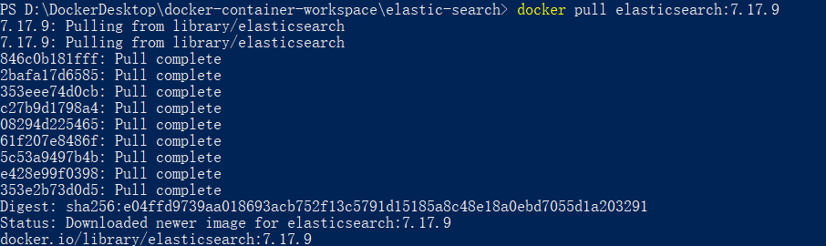
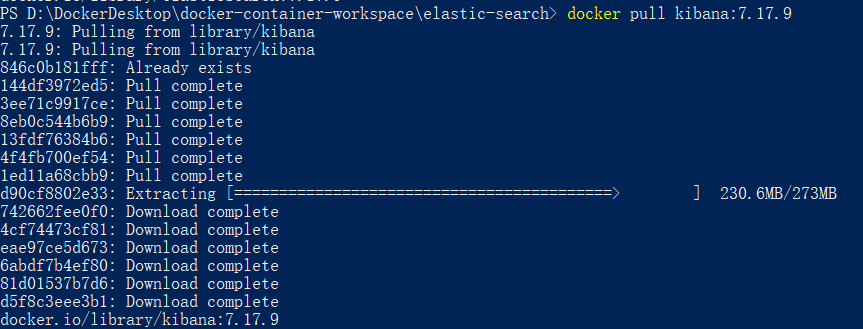
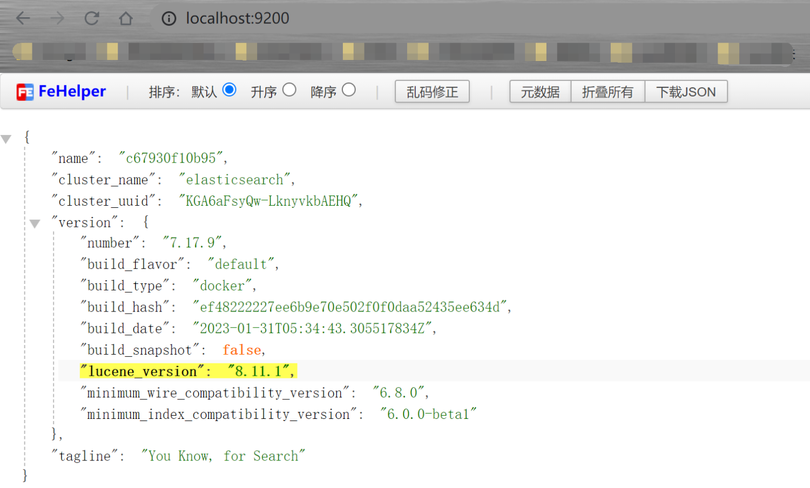
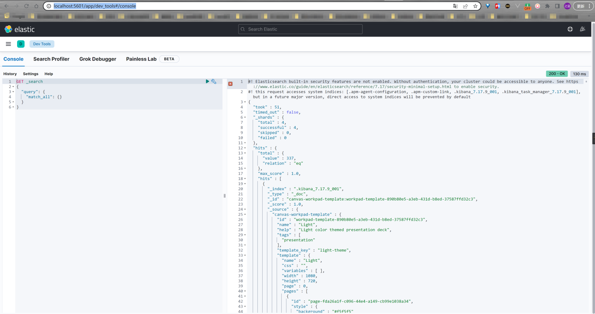

# DockerDesktop 版本（win10）

## Elasticsearch 和 Kibana 版本关系

在使用 Kibana 时，需要注意 Kibana 的版本号必须和 ES 的版本相互对应，不然会出现 Kibana 和 ES 不兼容的问题，导致 Kibana
安装后不能使用。具体的版本对应问题，可以参考官网：[elasticsearch 和 Kibana 版本关系](https://www.elastic.co/cn/support/matrix#matrix_compatibility)


## 下载 Elasticsearch

```shell
docker pull elasticsearch:7.17.9
```



## 下载 Kibana

```shell
docker pull kibana:7.17.9
```



## 启动 Elasticsearch 容器

### 创建挂载目录


config：用于放置配置相关的目录

data：用于放置产生的数据的目录

plugins：用于放置插件

### 新增 elasticsearch.yml 配置文件

在 config 目录下面新建 `elasticsearch.yml` 配置文件（这里的 `host: 0.0.0.0` 中间是有空格的。如果无，启动失败），文件内容如下：

```yaml
http.host: 0.0.0.0
```

### 单节点启动

```shell
# 创建 docker 网络
docker network create elastic

# 启动
docker run --name elasticsearch --network elastic -p 9200:9200 -p 9300:9300 -e "discovery.type=single-node" -e
ES_JAVA_OPTS="-Xms64m -Xmx128m" -v D:/DockerDesktop/docker-container-workspace/elastic-search/config/elasticsearch.yml:
/usr/share/elasticsearch/config/elasticsearch.yml -v D:/DockerDesktop/docker-container-workspace/elastic-search/data:
/usr/share/elasticsearch/data -v D:/DockerDesktop/docker-container-workspace/elastic-search/plugins:
/usr/share/elasticsearch/plugins -d elasticsearch:7.17.9
```

### 将 elasticsearch 容器设置为自启动

```shell
docker update --restart=always elasticsearch
```

### 验证启动是否成功

在浏览器输入 [http://127.0.0.1:9200/](http://127.0.0.1:9200/)，出现如下图所示表示启动成功！



## 启动Kibana容器

### 启动容器

```shell
docker run --name kibana --network elastic -p 5601:5601 -e "ELASTICSEARCH_HOSTS=http://elasticsearch:9200" -d kibana:7.17.9
```

### 将 kibana 容器设置为自启动

```shell
docker update --restart=always kibana
```

### 验证是否启动成功

在浏览器输入 [http://localhost:5601/](http://localhost:5601/)，出现如下图所示表示启动成功！


进入开发者工具页面：[http://localhost:5601/app/dev_tools#/console](http://localhost:5601/app/dev_tools#/console)



## 停止或者删除容器

```shell
# 停止容器
docker stop elasticsearch
docker stop kibana

# 删除网络配置和容器
docker network rm elastic
docker rm elasticsearch
docker rm kibana
```

---

# Docker命令行版本（CentOS 7）

由于和 win10 下面的 docker 命令差不多，这里不再过多赘述，只贴出命令汇总，如下所示：

```shell
# 拉取 7.17.9 版本的 elasticsearch
docker pull elasticsearch:7.17.9

# 拉取 7.17.9 版本的 kibana，注意这里的版本和 elasticsearch 一致
docker pull kibana:7.17.9

# 创建文件目录
mkdir -p /home/你的用户名/docker/elasticsearch/config
mkdir -p /home/你的用户名/docker/elasticsearch/data
mkdir -p /home/你的用户名/docker/elasticsearch/plugins

# 赋予文件权限，防止容器启动失败
chmod -R 777 /home/你的用户名/docker/elasticsearch/

# 新增内容到 elasticsearch.yml 配置文件（这里的 host: 0.0.0.0 中间是有空格的。如果无，启动失败）
echo "http.host: 0.0.0.0" >> /home/你的用户名/docker/elasticsearch/config/elasticsearch.yml

# 创建docker 网络
docker network create elastic

# 启动 elasticsearch 容器
docker run --name elasticsearch --network elastic -p 9200:9200 -p 9300:9300 \
-e "discovery.type=single-node" \
-e ES_JAVA_OPTS="-Xms64m -Xmx128m" \
-v /home/你的用户名/docker/elasticsearch/config/elasticsearch.yml:/usr/share/elasticsearch/config/elasticsearch.yml \
-v /home/你的用户名/docker/elasticsearch/data:/usr/share/elasticsearch/data \
-v /home/你的用户名/docker/elasticsearch/plugins:/usr/share/elasticsearch/plugins \
-d elasticsearch:7.17.9

# 将 elasticsearch 容器设置为自启动
docker update --restart=always elasticsearch

# 启动 kibana 容器
docker run --name kibana --network elastic -p 5601:5601 -e "ELASTICSEARCH_HOSTS=http://elasticsearch:9200" -d kibana:7.17.9

# 将 kibana 容器设置为自启动
docker update --restart=always kibana

# 停止容器
docker stop elasticsearch
docker stop kibana

# 删除网络配置和容器
docker network rm elastic
docker rm elasticsearch
docker rm kibana
```

---

# 复杂环境搭建

## 单机&集群

单台 Elasticsearch 服务器提供服务，往往都有最大的负载能力，超过这个阈值，服务器性能就会大大降低甚至不可用，所以生产环境中，一般都是运行在指定服务器集群中。

除了负载能力，单点服务器也存在其他问题：

- 单台机器存储容量有限
- 单服务器容易出现单点故障，无法实现高可用
- 单服务的并发处理能力有限

配置服务器集群时，集群中节点数量没有限制，大于等于 2 个节点就可以看做是集群了。一般出于高性能及高可用方面来考虑集群中节点数量都是 3 个以上。

总之，集群能提高性能，增加容错。

## 集群 Cluster

**一个集群就是由一个或多个服务器节点组织在一起，共同持有整个的数据，并一起提供索引和搜索功能**。一个 Elasticsearch 集群有一个唯一的名字标识，这个名字默认就是
”elasticsearch”。这个名字是重要的，因为一个节点只能通过指定某个集群的名字，来加入这个集群。

## 节点 Node

集群中包含很多服务器，一个节点就是其中的一个服务器。作为集群的一部分，它存储数据，参与集群的索引和搜索功能。

一个节点也是由一个名字来标识的，默认情况下，这个名字是一个随机的漫威漫画角色的名字，这个名字会在启动的时候赋予节点。这个名字对于管理工作来说挺重要的，因为在这个管理过程中，你会去确定网络中的哪些服务器对应于 Elasticsearch
集群中的哪些节点。

一个节点可以通过配置集群名称的方式来加入一个指定的集群。默认情况下，每个节点都会被安排加入到一个叫做 “elasticsearch”
的集群中，这意味着，如果你在你的网络中启动了若干个节点，并假定它们能够相互发现彼此，它们将会自动地形成并加入到一个叫做 “elasticsearch” 的集群中。

在一个集群里，只要你想，可以拥有任意多个节点。而且，如果当前你的网络中没有运行任何 Elasticsearch 节点，这时启动一个节点，会默认创建并加入一个叫做“elasticsearch”的集群。

# Windows 集群部署

## 部署集群

### 下载 ElasticSearch 7.17.9

下载地址：[https://www.elastic.co/cn/downloads/past-releases/elasticsearch-7-17-9](https://www.elastic.co/cn/downloads/past-releases/elasticsearch-7-17-9)

### 复制文件作为集群节点

将上述下载的 `elasticsearch-7.17.9-windows-x86_64.zip` 包进行解压，并进入解压目录下的 `elasticsearch-7.17.9` 目录，将该目录复制到一个新建的 `cluster` 目录下，并复制三份作为三个节点，如下图所示：


### 修改配置

修改集群文件目录中每个节点下的 `config/elasticsearch.yml` 配置文件，以节点 node-1 为例，修改配置内容如下：

# 参考

官方安装教程：[https://www.elastic.co/guide/en/kibana/7.17/docker.html](https://www.elastic.co/guide/en/kibana/7.17/docker.html)
